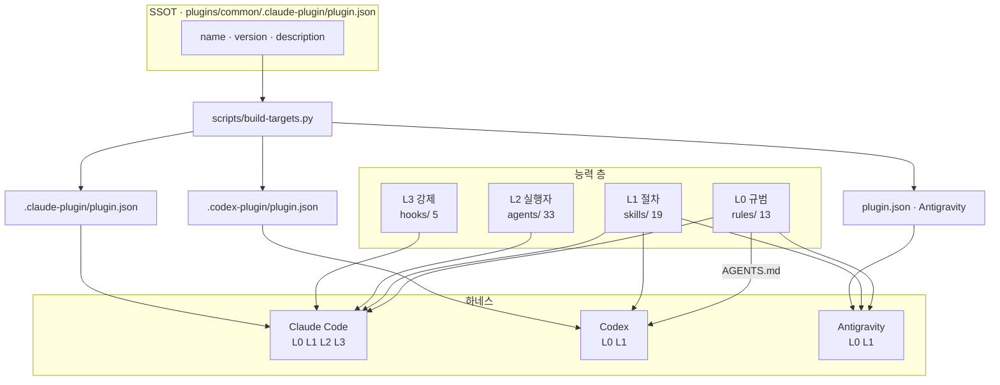
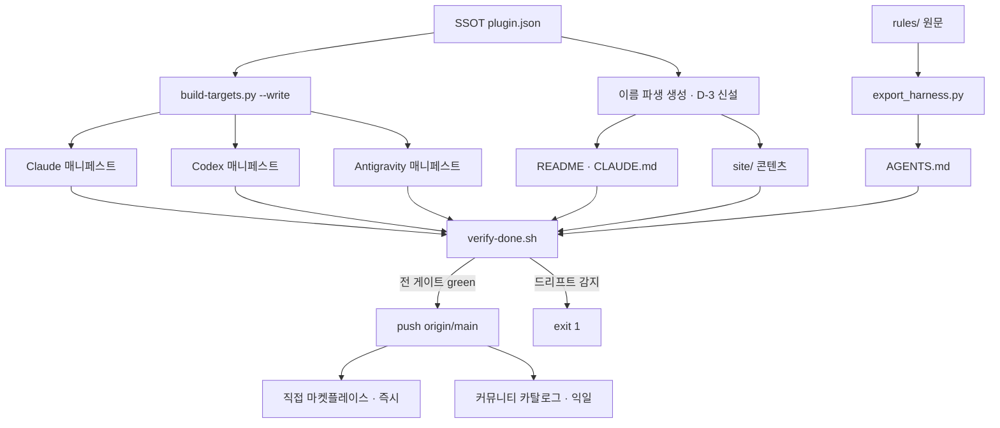
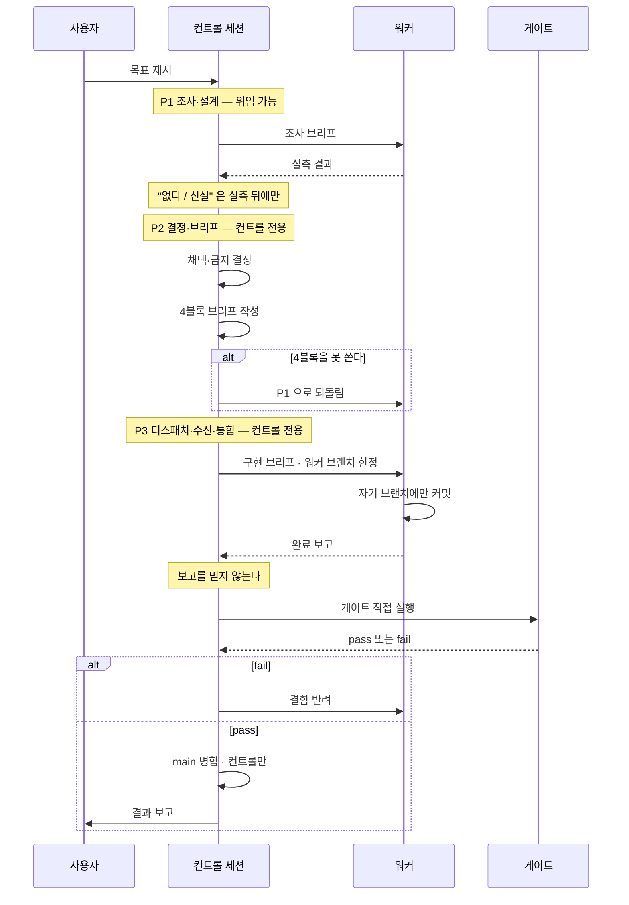
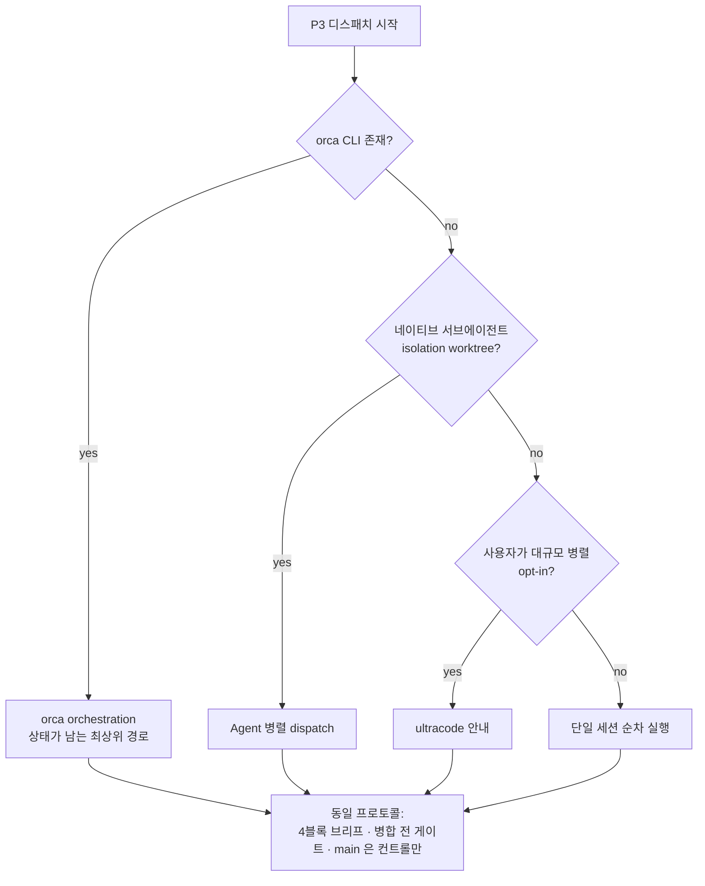
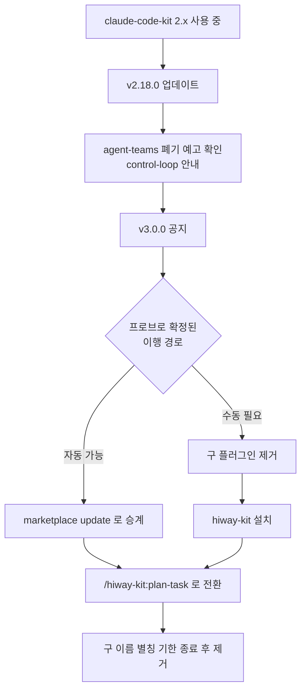
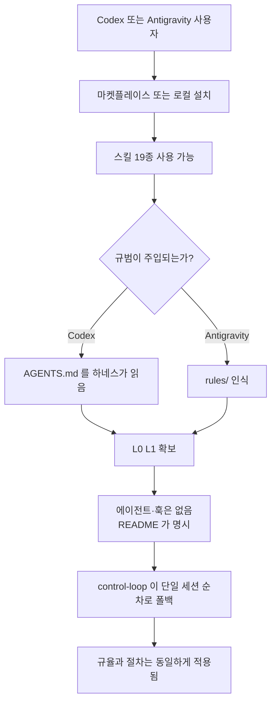
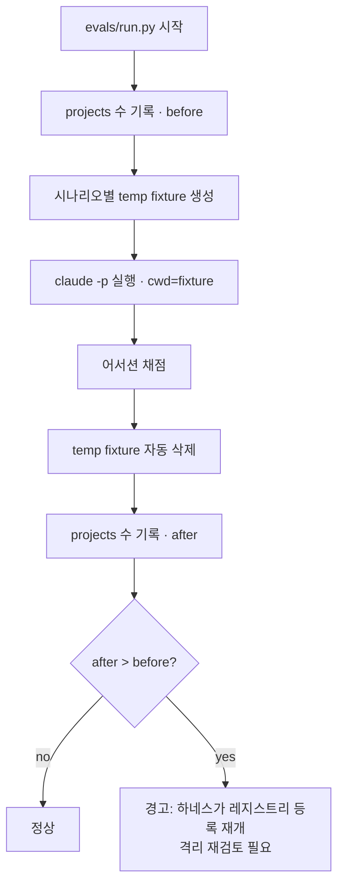
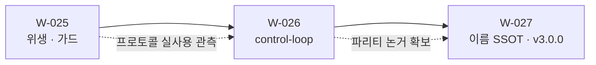

# 하이웨이 프로그램 설계 — 하네스 중립 전환 (W-025 ~ W-027)

> 상태: **설계 최종본**. 구현 전. 이 문서가 세 배치의 SSOT다.
> 작성: 2026-09-07 / 컨트롤 세션 `This-HW/planning-control-session` @ 086b2ae
> 선행 브리프: 세션 내 아티팩트 "하이웨이 전환 브리프" (본 문서가 그것을 대체·정정한다)

---

## 0. 목표와 판단 기준

**목표.** 킷을 "Claude Code 전용 플러그인"에서 "하네스 중립 에이전트 규율 킷"으로 옮기되,
**이름이 약속하는 것과 실제로 이식되는 것이 어긋나지 않게** 한다.

**판단 기준(모든 결정에 동일 적용).**

1. **약속과 실물의 일치** — 문서·이름·매니페스트가 주장하는 것은 실측으로 뒷받침돼야 한다.
   이 레포가 반복해서 잡아온 결함은 전부 "켜져 있다는 착각" 계열이다.
2. **부채 없음** — 같은 질문에 답하는 컴포넌트를 둘 두지 않는다. 생성물은 SSOT에서 파생한다.
3. **소비자 우선** — 설치하는 사람의 환경에서 동작해야 한다. 특정 플러그인·MCP·CLI의 존재를 가정하지 않는다.

---

## 1. 관측 — 실측 근거

### 1.1 하네스별 실제 이식 범위

| 컴포넌트 | 개수 | Claude Code | Codex | Antigravity |
| --- | ---: | --- | --- | --- |
| skills | 19 | 전부 | 전부 | 전부 |
| rules | 13 | 세션 주입 | `AGENTS.md` 경유 | 인식 |
| agents | 33 | 전부 | 전용 필드 없음 | **0종 인식** |
| hooks | 5 | 전부 | 의미 없음 | 싣지 않음 |

근거는 새로 만든 것이 아니라 `packaging/targets.json` 에 이미 실측 기록으로 있다 —
`agy` 는 `agents/` 를 재귀하지 않아 카테고리 디렉토리 4개를 "에이전트 4개"로 오등록하고
실제 33개는 하나도 읽지 못한다. Codex 훅은 형식 변환은 되지만 킷의 훅 5개가 전부 Claude Code
이벤트 모델(`hookSpecificOutput.additionalContext`, `tool_name` 매처, `decision:block`)에
묶여 있어 실행돼도 제어 효과가 없다.

### 1.2 지금 어디에도 설치돼 있지 않다

```
$ find ~/.codex/plugins -maxdepth 3 -type d   → openai-curated-remote 뿐. kit 없음
$ ls ~/.antigravity/extensions/               → VS Code 확장뿐. kit 없음
```

다중 하네스 지원은 **생성 + 1회 실측 검증**까지고 상시 사용이 아니다. 즉 현재의 "3사 공통"은
**매니페스트 수준의 주장**이다.

### 1.3 이름이 SSOT에서 파생되지 않는다

`git grep -l "claude-code-kit"` → **59개 파일**. `build-targets.py` 가 매니페스트 3종을
SSOT에서 생성하는 규율을 세워뒀는데, 문서·사이트·스킬 본문의 이름은 그 규율 밖이다.
**개명 비용이 파일 수에 비례한다는 것 자체가 부채다.**

### 1.4 정정 — eval 레지스트리 오염은 현행 결함이 **아니다**

선행 브리프는 `~/.claude.json` 의 유령 프로젝트 26건을 "eval 러너가 지금도 오염시킨다"고
적었다. **대조 실험으로 반증됐다.**

| 실험 | 명령 | projects 델타 |
| --- | --- | ---: |
| 대조군 | 임시 디렉토리에서 `claude -p` | **0** |
| 실제 eval 형태 | `-p` + `--append-system-prompt` + `--permission-mode bypassPermissions` + `--allowedTools` | **0** |
| 격리 실험 | `CLAUDE_CONFIG_DIR=<tmp>` | 0 (격리 자체는 동작 — 전용 `.claude.json`·`projects/`·`sessions/` 생성) |

`evals/run.py:1134` 의 `tempfile.TemporaryDirectory(prefix="ckkit-eval-…")` 와
`subprocess.run(cmd, cwd=str(work_dir))` 는 사실이지만, **현행 Claude Code 2.1.263 은
`-p` 세션의 cwd 를 전역 레지스트리에 등록하지 않는다.** 유령 26건은 과거 버전의 잔재다.

> 부수 관측: `CLAUDE_CONFIG_DIR` 로 config dir 를 격리하면 **인증이 따라가지 않는다**
> ("Not logged in"). 키체인 항목(`svce="Claude Code-credentials"`)은 config dir 로
> 스코프되지 않는데도 그렇고, `oauthAccount`·`userID`·`hasCompletedOnboarding` 를
> 시드해도 해소되지 않았다. **따라서 격리는 채택하지 않는다** — 동작하지 않는 격리를
> 넣는 것이 오염보다 나쁘다.

**설계에 미치는 영향**: W-025 에서 "러너 수정"은 빠진다. 남는 것은 ① 일회성 청소와
② 회귀 가드다.

### 1.5 로컬 위생

- **처리 완료** — `~/.claude/mcp-disabled-stash.json` 삭제. 평문 API 키 2건(gemini·magic)이
  3개월간 방치돼 있었다. 사용자가 미사용 확인. **발급처 폐기는 사용자 몫으로 남아 있다.**
- 잔재: 고아 임시 클론 4개 + `cck-probe-marketplace`(W-019 프로브) + 킷 구버전 캐시 2개 ≈ 5.2MB
- 유령 플러그인 설치 기록 8건 (삭제된 워크트리 7 + `all-note` 1)
- 설정 백업 4개 (`settings.json.bak`, `config.toml.bak`, `.backup-20260828-llama-local`, `.bak-D368`)
- `settings.json` 33KB 중 79% 가 orca 훅 shim 12벌 반복 — **orca 소유, 손대지 않는다**
- `permissions.allow` 42개가 `skipDangerousModePermissionPrompt: true` + bypass 상시 운영과 공존
- 정상 확인: 전역 `CLAUDE.md` 226B(graphify 하나), `~/.claude/agents/`·`commands/` 비어 있음 — 이중 로드 없음

---

## 2. 결정

### D-1 — 이름은 하나다. dual-name 을 채택하지 않는다

사용자 제안: *"Claude 쪽은 `claude-code-kit` 로 두고 업데이트분만 `hiway-kit` 으로 추가"*.
**반려한다.** 근거:

- **기능 충돌** — Claude Code 사용자가 둘 다 설치하면 같은 19개 스킬·33개 에이전트가
  두 네임스페이스로 **중복 등록**된다. 이름 충돌이지 미관 문제가 아니다.
- **불변식 파괴** — `packaging/targets.json` 의 `source._meta.authority` 는
  *"name·version·… 의 SSOT는 이 매니페스트다. 어떤 타겟 생성물도 이 값을 재정의하지 않는다"* 다.
  타겟별로 다른 이름을 쓰면 이 불변식이 깨지고, **네 번째 드리프트 게이트**가 필요해진다 —
  이 레포는 그 통합을 명시적으로 거부해 뒀다.
- **부채 형태** — 일회성 이행 비용을 피하려고 **영구 분기**를 만드는 거래다. 릴리스·문서·이슈가
  전부 두 갈래가 된다.

사용자의 실제 관심사(**기존 설치를 깨지 않는 것**)는 분기가 아니라 **기한 있는 폐기 별칭**으로
푼다 → D-4.

### D-2 — 파리티 계약: 4층 + 폴백 사다리

세 하네스에 무엇을 약속할지 확정한다. 최소공통분모로 깎으면(스킬만 남기면) Claude Code 에서의
가치가 붕괴하고, 전부 이식하려 하면 플랫폼이 막는다. **층으로 나누고, 각 층이 위층으로
degrade 되게 한다.**

| 층 | 내용 | 도달 범위 | 없을 때의 폴백 |
| --- | --- | --- | --- |
| **L0 규범** | `rules/` 13 | 전 하네스 (CC=주입, 그 외=`AGENTS.md`) | — (최종 폴백) |
| **L1 절차** | `skills/` 19 | 전 하네스 | L0 규범이 문장으로 남는다 |
| **L2 실행자** | `agents/` 33 | Claude Code | L1 스킬이 단일 세션 순차로 수행 |
| **L3 강제** | `hooks/` 5 | Claude Code | L0 규범이 약한 강제로 남는다 |

**약속 문장(README·매니페스트가 같은 말을 해야 한다):**

> 규범과 절차(L0·L1)는 모든 하네스 공통. 전용 실행자와 자동 강제(L2·L3)는 Claude Code 심화 기능.

이 계약이 정직한 이유: 폴백 사다리가 있어 **L2·L3 가 없어도 킷이 무의미해지지 않는다.**
Codex 사용자는 규율과 절차를 얻고, 자동화만 잃는다.

### D-3 — 이름을 SSOT에서 파생시킨다 (개명의 선행 과제)

`build-targets.py` 가 매니페스트에 하는 일을 문서·사이트에도 적용한다. 개명 비용을
**파일 수 비례 → 상수**로 바꾼다. 이것이 없으면 v3.0.0 개명은 59파일 수작업이고,
다음 개명도 같은 값을 다시 낸다.

- 적용 대상: `README.md`, `plugins/common/README.md`, `site/` 콘텐츠, `CLAUDE.md`, 스킬 본문
- 방식: SSOT(`plugin.json` 의 `name`)에서 파생하는 생성 단계 + `verify-done.sh` 드리프트 검사
- **주의**: 이것이 § 드리프트 게이트 **네 번째**가 된다. 레포 규약상 *"네 번째가 필요해지는
  시점에 재검토"* 하기로 돼 있으므로, W-027 에서 기존 셋(§11·§13·§14)과 **묶을지 판단**한다.
  묶지 않기로 결론 나면 그 근거를 CLAUDE.md 에 기록한다.

### D-4 — 개명은 v3.0.0 한 번. 이행 경로는 실측 후 확정

- 새 이름: **`hiway-kit`**. 네임스페이스 프리픽스가 사용자 타이핑 표면이므로 18자 → 9자가
  실질 이득이다(`/claude-code-kit:plan-task` → `/hiway-kit:plan-task`). `hw` 는 하드웨어와
  충돌해 탈락, `hiway-code-kit` 은 이득이 절반.
- **이행 메커니즘은 지금 확정하지 않는다.** 마켓플레이스 항목 이름과 `plugin.json` 의 `name`
  이 불일치할 때 설치가 성립하는지 확인되지 않았다. 이 레포의 기준(`runtime-verified`)에
  미달하므로, **스크래치 마켓플레이스 프로브로 실측한 뒤** 확정한다 — W-019 의
  `cck-probe-marketplace` 와 동일 기법(그 잔재가 지금 캐시에 남아 있다).
- 프로브가 답해야 할 질문: ① 구 이름 항목을 폐기 표시로 남긴 채 신 이름으로 설치가 되는가
  ② 구 이름 설치본과 신 이름 설치본이 공존할 때 스킬·에이전트가 중복 등록되는가
  ③ `enabledPlugins` 키 이행이 자동인가 수동인가
- 커뮤니티 카탈로그는 **이름 변경 = 새 리스팅**이다(버전 갱신과 달리 재제출 필요).

### D-5 — 컨트롤 스킬은 하나, 3페이즈

축은 *기획 대 컨트롤*이 아니라 **결정 대 조사**다. 판별식은 이미 있다 —
*"브리프에 IN/OUT·수용 기준·금지 목록을 4블록으로 쓸 수 있으면 워커"*.
이 테스트를 설계 작업에 대면 설계는 통째로 한쪽에 가지 않고 **쪼개진다**: 설계에 필요한
*조사*는 4블록으로 쓸 수 있어 위임 가능하고, *결정*은 4블록을 **쓰는 행위 자체**라 위임 불가.

따라서 스킬을 기획용·컨트롤용으로 나누지 **않는다**. 나누면 결정과 브리프 작성 사이에
이음매가 생기는데, 그 이음매가 관측된 실패 지점이다 — 올림포스 운영에서 **컨트롤이 전제를
추측해 쓴 브리프가 하루 4건 워커에게 반려**됐다.

**스킬명: `control-loop`.** 레포에 이미 있는 `rules/loop-engineering.md` 어휘와 맞는다.

### D-6 — 운송(transport)은 규범이 아니라 부록이다

`orca` 는 배포물(`plugins/`) 안에 0건이다. 우연이 아니라 소비자 우선 원칙의 결과다.
`control-loop` 의 **규범 본문은 운송을 모른다** — 프로토콜(역할 경계·4블록 계약·검증·통합)만
소유한다. 운송별 실행 레시피는 **비규범 부록**으로 분리하고, 각 항목은 감지 명령 + 최소 레시피만
담는다. 부록이 낡아도 스킬은 계속 동작한다. (`rules/` ↔ `docs/architecture/rules/` 의 정본-해설
분리와 같은 층 나눔.)

### D-7 — `agent-teams` 는 흡수 후 폐기 (기한 있는 2단계)

`agent-teams` 는 현재 "대규모는 `ultracode` 로 가라"는 라우팅 안내뿐이고, 그것은
`control-loop` 부록의 한 운송 항목이다. 같은 질문에 답하는 스킬 둘을 남기지 않는다.

1. **v2.19.0** — `control-loop` 신설. *(초안은 v2.18.0 이었다. W-025 C 트랙이 2.18.0 을 쓰므로 §11.2(f) 에서 이동)* `agent-teams` 본문을 폐기 예고로 교체(내용은 흡수됨,
   `control-loop` 를 가리킴). 스킬 수 19 유지.
2. **v3.0.0** — `agent-teams` 제거. 스킬 수 19 → 18. `check_doc_counts.py` 대상 문서 전부 갱신.

메이저에서 제거하는 이유: 스킬 삭제는 `/agent-teams` 를 치던 사용자에게 파괴적 변경이다.

### D-8 — `control-loop` 의 eval 은 C등급으로 **명시 등재**한다

`evals/` 의 시나리오 29종은 전부 *에이전트 한 종의 단일 출력*을 채점한다. `control-loop` 는
여러 턴에 걸친 세션 행동이라 이 러너로 채점할 수 없다.

**침묵하지 않는다.** `evals/policy.json` 의 `tiers._tier2Classification` 에 등급 `C` + 사유 +
승격 조건과 함께 등재한다. W-024 가 신설한 `check_classification_complete` 가 이 누락을
위 문장은 **§12.3 이 반증했다** — 그 검사는 에이전트만 스캔하므로 스킬인 `control-loop` 은 영원히 걸리지 않는다. **D-8 의 강제 기전 주장은 §12.3 으로 대체됐다.**

> 이것이 `consensus-builder` 사고(분류엔 있는데 시나리오가 없어 조용히 통과)의 재발 방지다.
> 다른 점: 그때는 A등급이라 시나리오가 **있어야 했고**, 지금은 C등급이라 **없는 것이 정답**이며
> 그 사실이 기록된다.

### D-9 — 4블록 브리프는 기계 게이트를 두지 않는다 (의도적)

W-021/022 가 폐기한 `---DELEGATION_SIGNAL---` 과 겉모습이 비슷하므로 차이를 명시한다.

| | 폐기된 신호 블록 | 4블록 브리프 |
| --- | --- | --- |
| 소비자 | **없음** — 파싱하는 코드가 어디에도 없었다 | **워커 에이전트** — 실제로 읽고 그대로 수행한다 |
| 누락 시 | 아무 일도 안 일어남 (조용한 무효화) | 워커가 완료 조건을 몰라 **에스컬레이션한다** |
| 강제 방식 | 자연어 지시 → 모델 판단 | 소비 지점에서 자연 발생 |

**소비자가 있는 계약은 게이트 없이도 산다.** 없던 것이 폐기된 이유였다.

### D-10 — eval 잔재는 청소하되, 회귀 가드를 남긴다

§1.4 로 러너 수정은 불필요해졌다. 그러나 26건이 **몇 달간 아무도 모르게** 쌓였다는 사실은
남는다 — *"검사 대상이 아닌 것은 결코 red 가 되지 않는다"*.

- 일회성: 유령 프로젝트 항목 28건 정리
- 가드: 러너가 **전체 실행 전후의 `~/.claude.json` projects 수를 비교**해 증가 시 경고.
  추가 API 비용 0, 코드 ~10줄. 하네스가 다시 등록하기 시작하면 그날 알게 된다.

### D-11 — permissions 는 "인정하고 최소화"로 간다

현재는 `skipDangerousModePermissionPrompt: true` + bypass 상시 운영이라 42개 allowlist 가
**실제로 게이트하는 것이 거의 없다.** 방어선이 있다고 *믿게 만드는* 상태가 가장 나쁘고,
이는 킷이 반복해서 잡아온 "켜져 있다는 착각"과 같은 클래스다.

**채택**: bypass 운영을 인정하고 allowlist 를 **정직한 최소**로 줄인다.
프로젝트 전용(`Bash(hantu:*)`)과 광범위 쓰기(`curl`·`ssh`·`scp`·`source`·`chmod`)를 뺀다.
bypass 를 끄는 날 allowlist 가 **검토된 진짜 방어선**이 되게 하는 것이 목적이다.
되돌리기는 한 커밋이다.

---

## 3. 시스템 아키텍처

### 3.1 능력 층과 하네스 도달 범위



### 3.2 폴백 사다리 — 없는 층은 위층이 받는다


이 사다리가 D-2 파리티 계약을 정직하게 만든다 — 하위 층이 없어도 킷이 무의미해지지 않는다.

---

## 4. 플로우

### 4.1 시스템 플로우 — 빌드에서 배포까지



### 4.2 시스템 플로우 — `control-loop` 3페이즈



### 4.3 시스템 플로우 — 운송 감지 사다리



규범은 `P` 하나다. 위 분기는 **비규범 부록**이며, 전부 실패해도 `SQ` 로 끝나 fail-open 한다.

### 4.4 유저 플로우 — 기존 사용자의 v3.0.0 이행



`E` 분기가 **미확정**이라는 것이 D-4 의 핵심이다. 프로브 전에는 어느 쪽도 문서에 쓰지 않는다.

### 4.5 유저 플로우 — 신규 사용자가 Codex/Antigravity 에서 설치



`H` 를 **숨기지 않는 것**이 D-2 계약의 요체다.

### 4.6 시스템 플로우 — eval 실행과 회귀 가드



---

## 5. 작업 분할



### W-025 — 위생 · 구조 정비 (§11.2 에서 3 트랙으로 재편, C 트랙만 버전 범프)

| 항목 | 내용 | 담당 |
| --- | --- | --- |
| 25-1 | 유령 프로젝트 항목 28건 정리 | 컨트롤 |
| 25-2 | eval 회귀 가드 (`run.py` projects 델타 경고) | 워커 |
| 25-3 | 플러그인 캐시 잔재 정리 (temp 클론 4 · cck-probe · 구버전 캐시) | 컨트롤 |
| 25-4 | 유령 플러그인 설치 기록 8건 정리 | 컨트롤 |
| 25-5 | 설정 백업 4개 정리 | 컨트롤 |
| 25-6 | `permissions.allow` 최소화 (D-11) | 컨트롤 |

25-2 만 워커인 이유: 코드 변경 + 되돌려-FAIL 테스트가 붙는 유일한 항목이다.
나머지는 환경 정리라 4블록 브리프를 쓸 대상이 없다.

### W-026 — `control-loop` 스킬 (v2.19.0 — §11.2(f)·§12 정정)

| 항목 | 내용 | 담당 |
| --- | --- | --- |
| 26-1 | `skills/control-loop/SKILL.md` — 3페이즈 규범 본문 | 워커 |
| 26-2 | 운송 부록 (비규범, 감지 사다리) | 워커 |
| 26-3 | `agent-teams` 폐기 예고로 교체 (D-7 1단계) | 워커 |
| 26-4 | `policy.json` 에 C등급 등재 (D-8) | 컨트롤 |
| 26-5 | 버전 범프 + CHANGELOG + 문서 카운트 | 컨트롤 |

**W-025 를 지금 방식으로 먼저 돌리는 것이 26-1 의 입력이다.** 프로토콜을 한 번 더 실사용
관측하고 그 관측을 재료로 쓴다 — 스킬을 먼저 쓰고 나중에 맞추지 않는다.

### W-027 — 이름 SSOT화 + v3.0.0

| 항목 | 내용 | 담당 |
| --- | --- | --- |
| 27-1 | 마켓플레이스 이행 프로브 (D-4 질문 3종 실측) | 워커 |
| 27-2 | 이름 SSOT 파생 생성기 + 드리프트 검사 (D-3) | 워커 |
| 27-3 | 네 번째 드리프트 게이트 통합 여부 판정 + 근거 기록 | 컨트롤 |
| 27-4 | 파리티 계약 문장을 README·매니페스트에 반영 (D-2) | 워커 |
| 27-5 | `hiway-kit` 개명 + `agent-teams` 제거 + 태그 | 컨트롤 |
| 27-6 | 커뮤니티 카탈로그 재제출 | 컨트롤 |

---

## 6. 범위 밖 (명시적으로 하지 않는 것)

- **Codex·Antigravity 용 훅 재구현** — `targets.json` 의 `_hooksEnableWhen` 조건이 그대로 유효하다.
  형식 변환 가능성은 재검토 근거가 아니다.
- **`agents/` 디렉토리 구조 변경** — Antigravity 가 중첩을 재귀하지 않는다는 이유로 33개
  에이전트 레이아웃을 바꾸지 않는다. 플랫폼 한계를 킷 구조로 흡수하지 않는다.
- **Cursor·Pi·OpenCode 타겟 활성화** — 각각의 `_disabledReason` 이 유효하다.
- **`~/.claude/projects` 1.4GB 정리** — 트랜스크립트는 메모리·`self-improve` 의 원천 자산이다.
  보존 기준을 정하기 전에는 지우지 않는다.
- **orca 오케스트레이션을 배포물에 넣는 것** — D-6.
- **`settings.json` 의 orca 훅 shim** — 남의 생성물이다.

---

## 7. 수용 테스트

**W-025**

1. `~/.claude.json` projects 에 경로가 없는 항목 0건
2. eval 1회 실행 후 projects 델타 0 이고, 인위적으로 증가시킨 상황에서 경고가 실제로 출력됨(되돌려-FAIL)
3. `scripts/verify-done.sh` green
4. bypass 를 끈 상태에서 축소된 allowlist 로 일상 작업이 성립함

**W-026**

5. `control-loop` 규범 본문에 `orca` 문자열 0건 (`git grep -c orca plugins/common/skills/control-loop/SKILL.md`)
6. `check_classification_complete` 가 경고 없이 통과 (C등급 등재 확인)
7. `agent-teams` 를 호출하면 `control-loop` 로 안내됨
8. 문서 카운트 게이트 green (스킬 19 유지)

**W-027**

9. 프로브가 D-4 의 질문 3종에 `runtime-verified` 답을 남김
10. `plugin.json` 의 `name` 만 바꾸고 생성기를 돌리면 문서·사이트 이름이 전부 따라옴
11. 세 매니페스트의 `name` 이 SSOT 와 일치 (`build-targets.py --check`)
12. README 의 파리티 문장과 매니페스트 `description` 이 같은 약속을 말함

---

## 8. 구조 감사 — 추상화·교체가능성 (2026-09-07 추가)

> 이 절은 §2·§5·§7 을 **개정**한다. 결정 D-12~D-15 와 작업 항목·수용 테스트가 추가된다.
> 계기: "모듈·메서드 단위로 추상화가 잘 돼 있는가, 나중에 리팩토링하지 않아도 되는가" 점검.

### 8.1 측정값

| 지표 | 값 | 판정 |
| --- | --- | --- |
| 구현 / 테스트 | 7,573행 / 6,693행 (비율 0.88) | 양호 — 교체 시 행동이 고정돼 있다 |
| 함수 806개 중 50행 초과 | 21개 (2.6%) · 100행 초과 5개 | 양호 — god function 코드베이스가 아니다 |
| 레포 내부 모듈 간 import | **0건** (훅→`utils` 의 `sys.path` 경로 제외) | 매우 낮은 결합 — 최대 강점 |
| 데이터 주도 확장 지점 | `packaging/targets.json` 1곳 | 나머지가 따라야 할 모델 |

**결합도 0 이 이 코드베이스의 핵심 자산이다.** 각 스크립트가 독립 실행 단위라 하나를
통째로 갈아도 나머지가 안 깨진다. 아래 결함들은 전부 이 강점을 해치지 않는 범위에서 고친다.

### 8.2 발견

| # | 내용 | 심각도 |
| --- | --- | --- |
| F1 | `evals/run.py` 1,520행이 책임 8개를 담고, **하네스 호출이 함수 하나에 박혀 있다** (`build_claude_command`) | **높음 — 프로그램 목표와 충돌** |
| F2 | 어서션 계약이 `KNOWN_ASSERTION_TYPES`(스키마)와 `check_assertion`(채점) **두 곳에 선언**되고 동기화를 강제하는 것이 없다 | 중 |
| F3 | 하이픈 파일명 7개가 import 를 막아 `spec_from_file_location` 보일러플레이트가 **12곳**에 복제 | 중 |
| F4 | 경로 봉쇄 헬퍼가 **4벌**인데 이름이 3가지(`_safe_join`·`_resolve_target`·`_resolve_in_repo`×2) | 중 |
| F5 | `hooks/utils.py` 를 훅 8개 중 3개만 사용. stdin JSON 파싱은 5개에 중복 | 낮음 — 아래 판정 참조 |
| F6 | `check_eval_coverage.py` 의 체크 4종이 `main()` 에 동일 블록으로 수작업 배선 | 낮음 |

### D-12 — 하네스 호출 심을 추출한다 (F1). **프로그램의 자기모순을 막는 항목이다**

`evals/run.py` 의 `build_claude_command()` 는 `claude` CLI 인자를 직접 조립한다.
W-027 이 킷을 "하네스 중립"으로 선언하는데, **그 주장을 검증하는 행동 eval 은 Claude Code
하나만 구동할 수 있다.** 이는 이 문서의 기준 1(약속과 실물의 일치)을 정면으로 위반한다 —
§7 수용 테스트에도 이 구멍이 없었다.

**결정**: `run.py` 전체를 모듈로 쪼개지 않는다(결합도 0 을 해칠 이유가 없고, 나머지 7개
책임은 함께 변하는 것들이다). **하네스 호출 지점 하나만** 심으로 뽑는다 —
`build_claude_command(agent, task)` → `Harness` 프로토콜 + `ClaudeCodeHarness` 단일 구현.
새 하네스를 붙이는 비용을 "`run.py` 를 읽고 고친다"에서 "구현 하나를 추가한다"로 바꾼다.

**시기**: W-026 (W-027 의 파리티 선언보다 **앞서야** 한다).

**동시에 정직해진다**: 심이 있어도 Codex·Antigravity 구현을 이번에 만들지는 않는다.
따라서 README 의 파리티 문장은 *"행동 eval 은 현재 Claude Code 만 구동한다"* 를
명시해야 한다 — 수용 테스트에 추가한다.

### D-13 — 어서션 계약을 한 곳으로 모은다 (F2)

현재 두 구조는 **우연히 동기**다(AST 대조로 확인: 선언 9종 = 채점 9종, 양방향 차집합 0).
그러나 이를 강제하는 테스트가 없고, `KNOWN_ASSERTION_TYPES` 를 `run.py` 밖에서 참조하는
코드도 없다. 실패 모드가 fail-closed 라 아직 안 물렸을 뿐이다.

**결정**: 레지스트리 한 곳으로 합치되 **큰 리팩토링은 하지 않는다.**
`{타입: (필수필드, 채점함수)}` 딕셔너리 하나를 두고 스키마 검증과 디스패치가 같은 표를
읽게 한다. 그것이 과하다고 판단되면 **최소한 동기화 테스트**를 넣는다 —
"선언 집합 == 채점 집합" 어서션 하나. 어느 쪽이든 *한 곳만 고치면 되는 상태*가 목표다.

### D-14 — 하이픈 파일명은 **바꾸지 않는다**. 로더만 공유한다 (F3)

직관적인 해법(파일명을 언더스코어로 개명)을 **기각한다.** 훅 파일명은
`hooks.json` 뿐 아니라 CHANGELOG·완료된 Work 문서·과거 스펙 등 **약 40개 파일**에서
참조된다. 그중 다수는 과거 결정을 기록한 불변 문서다.

이는 `verify-done.sh` 섹션 번호를 동결한 것과 **정확히 같은 판단**이다 —
*"표시를 고치자고 기록의 참조를 깨는 것은 부채를 갚는 게 아니라 옮기는 것이다."*
파일명은 안정 식별자이고, 보일러플레이트는 그 대가다.

**결정**: 파일명 유지. 대신 `spec_from_file_location` 보일러플레이트 12벌을
**테스트 로더 헬퍼 하나**로 접는다(`load_module_by_path(path)`). 파일명을 하나도 건드리지
않고 11벌이 사라진다. `check_eval_coverage.py` 안의 3.10 dataclass/`sys.modules` 주의사항도
그 헬퍼 한 곳에만 남는다.

### D-15 — 경로 봉쇄 헬퍼는 이름을 통일하고 **공유 케이스 표**로 묶는다 (F4)

CLAUDE.md 는 이 중복을 의도로 명시한다 — *"위 두 파일의 헬퍼를 그대로 따라라. 관례를
새로 발명하는 것이 이 결함이 반복된 이유다."* 이 결정을 **뒤집지 않는다**(훅은 디렉토리를
넘는 import 가 불가능하므로 공용 라이브러리가 애초에 성립하지 않는다).

그러나 현재 4벌의 **이름이 3가지**이고 시그니처가 2가지다 — 관례로 복제하라면서 복제할
대상이 하나로 보이지 않는다. 같은 결함이 세 번 반복된 뒤 세운 관례가, 정작 관례로 기능하지
못하는 형태다.

**결정**: ① 이름을 `_resolve_in_repo` 하나로 통일 ② 네 구현 전부를 **동일한 적대적 케이스
표**(절대경로·`..`·심링크·TOCTOU)로 검증하는 공유 테스트 데이터를 둔다. 구현은 계속 4벌,
**계약은 한 벌**이 된다. 새 다섯 번째가 생기면 그 표에 등록만 하면 된다.

### D-16 — F5 는 결함이 아니다. 고치지 않는다

`utils.py` 를 훅 3/8 만 쓰고 stdin 파싱이 5벌인 것은 **의도로 유지한다.**
훅은 각각 독립 프로세스로 실행되고, 소비자의 `python3`(3.9 하한)에서 fail-open 해야 한다.
공유 계층을 키우면 `utils.py` 버그 하나의 폭발 반경이 훅 전체가 된다 — 2.12.1 의
"훅 4종이 조용히 죽어 있었다" 사고가 정확히 그 계열이다. **낮은 공유가 여기서는 정답이다.**

### 8.3 작업 항목 추가

**W-025 에 추가** (배치 성격을 "로컬·러너 위생"에서 **"위생 · 구조 정비"**로 넓힌다):

| 항목 | 내용 | 담당 |
| --- | --- | --- |
| 25-7 | 어서션 계약 단일화 또는 동기화 테스트 (D-13) | 워커 |
| 25-8 | 테스트 로더 헬퍼로 보일러플레이트 12 → 1 (D-14) | 워커 |
| 25-9 | 경로 봉쇄 헬퍼 이름 통일 + 공유 적대 케이스 표 (D-15) | 워커 |
| 25-10 | `check_eval_coverage.py` 체크 목록화 (F6) | 워커 |

**W-026 에 추가**:

| 항목 | 내용 | 담당 |
| --- | --- | --- |
| 26-6 | 하네스 호출 심 추출 — `Harness` 프로토콜 + `ClaudeCodeHarness` (D-12) | 워커 |

### 8.4 수용 테스트 추가

13. **W-025** · 어서션 타입을 하나 추가할 때 **한 곳만** 고치면 스키마 검증과 채점이 함께 반영된다
14. **W-025** · `spec_from_file_location` 문자열이 레포에 **1곳**만 남는다
15. **W-025** · 네 경로 헬퍼가 동일한 적대 케이스 표를 통과하고, 이름이 전부 `_resolve_in_repo` 다
16. **W-026** · `run.py` 에 `"claude"` 리터럴이 `ClaudeCodeHarness` 안에만 존재한다
17. **W-027** · README 의 파리티 문장이 *"행동 eval 은 Claude Code 만 구동한다"* 를 명시한다

---

## 9. 주입 예산 재설계 — 규범을 덜어내되 잃지 않기 (2026-09-07 추가)

> 이 절은 §2·§5·§7 을 **개정**한다. 결정 D-17~D-21 과 W-025 작업 항목이 추가된다.
> 계기: "훅·세션 스타트에 규칙이 과하게 들어가 있다. 덜어내되 최고의 아키텍처로,
> 사람들이 언제든 보고 이해되도록."

### 9.1 측정 — 세션마다 실제로 주입되는 것

| 구성 | 크기 | 비중 | 출처 |
| --- | ---: | ---: | --- |
| RULES | **28,005B** | 82% | `rules/*.md` 13종 중 12종(ALWAYS_RULES) |
| WORKFLOW | **6,057B** | 18% | `using-claude-code-kit/SKILL.md` |
| **합계** | **34,062B** | | 매 세션, 무조건 |

> **정정됨(§12.1).** 최초 기재값(20,191 / 3,728 / 23,989)은 **문자수**였다. 위는 바이트 실측이며
> 재현 명령은 §12.1 에 있다.

비교 감각: `AGENTS.md` 는 §15 로 **24,576B 상한**이 걸려 있는데, 세션 주입은 그 **98%**를
아무 상한 없이 쓰고 있다 — 실제로는 **139%** 로 이미 넘겼다(§12.1). 한쪽에는 예산 게이트가 있고 다른 쪽에는 없다.

### 9.2 진단 — 크기가 아니라 **활성화 조건의 부재**다

13개 규범 중 **12개가 무조건** 주입된다(`ALWAYS_RULES`). 조건부는 `task-resume.md`
하나뿐이다. 그런데 실제로 언제나 참이어야 하는 규범은 그중 일부다 —
`parallel-worktree`(3,363B)는 병렬 워크트리를 쓸 때만, `mcp-usage`(3,427B)는 MCP가
있을 때만, `agent-delegation-chain`(3,814B)은 위임할 때만 의미가 있다.

세 종류의 낭비가 겹쳐 있다:

**(a) 호스트와 충돌하는 규범** — `tool-usage-priority.md` 는
*"NEVER use Bash for file operations. Read files → Read (NOT cat/head/tail)"* 라고 지시한다.
그런데 bypass 모드의 호스트 시스템 프롬프트는 정반대를 지시한다 —
*"read files with cat, head, or sed -n, search with grep and find … rather than using the
dedicated Read, Edit, or Write tools."* **주입된 규범이 호스트의 지시와 정면으로 싸운다.**

**(b) 네이티브가 이미 제공하는 것의 재기술** — 하네스는 시스템 프롬프트에 에이전트 33종과
스킬 19종을 설명과 `MUST USE when:` 트리거까지 붙여 이미 나열한다. 그 위에
`agent-system.md` 의 "Agent Selection by Keyword" 표와 WORKFLOW 의 "Skill Trigger Map"
표가 같은 내용을 다시 싣는다.

**(c) 소비자 중립성 위반** — `ssot.md` 는 TypeScript 파일 레이아웃(`import { API_URL } from
"@/config/env"`, `src/infrastructure/errors/*.ts`)을 규범으로 싣는다. 이 킷은 **어떤 언어의
프로젝트에도 설치되는** 범용 플러그인이다. `mcp-usage.md` 는 `## NotebookLM Rules` 절에서
특정 MCP 서버의 수치 제한(Source 50개)까지 규정한다 — 같은 파일이 세 줄 위에서
*"never assume a server is present"* 라고 말하면서.

### 9.3 관측된 결함 — 활성화 목록이 코드에 하드코딩돼 있다

`ALWAYS_RULES` 는 `session-start.py:197` 의 파이썬 리스트다. 이 상수를 참조하는 코드는
**그 파일과 그 파일의 테스트뿐**이고, 디렉토리와의 정합을 강제하는 게이트가 없다.

결과 두 가지:

1. **14번째 규범을 추가하면 조용히 주입되지 않는다.** 파일은 존재하고, CHECKSUMS 는
   집합 동등을 통과하고, 아무도 red 를 보지 못한다 — *"검사 대상이 아닌 것은 결코 red 가
   되지 않는다"* 의 정확한 재현이다. §8 의 F2(어서션 계약 이중 선언)와 **같은 결함 클래스**다.
2. **규범 파일을 열어도 자기가 언제 켜지는지 알 수 없다.** 알려면 훅의 파이썬 코드를
   읽어야 한다. 사용자 요구("사람들이 언제든 보고 이해되도록")가 지금 구조에서는 성립하지 않는다.

### D-17 — 활성화 조건을 **규범 자신이 선언한다**

`ALWAYS_RULES` 하드코딩 리스트를 제거하고, 각 규범이 frontmatter 로 자기 티어를 선언한다.
훅은 디렉토리를 스캔해 선언을 읽는다. `packaging/targets.json` 이 타겟에 대해 하는 일과
같은 모델이다 — **목록을 손으로 유지하지 않는다.**

```yaml
---
tier: core              # core | conditional | reference
activates: always       # conditional 인 경우 감지 신호를 적는다
---
```

| 티어 | 언제 주입되나 | 성격 |
| --- | --- | --- |
| **core** | 항상 | 스킬을 하나도 invoke 하지 않은 상태에서도 참이어야 하는 행동 기본값 |
| **conditional** | 훅이 신호를 감지했을 때 | 상황 규범. 이미 `task-resume` 가 이 방식이다 |
| **reference** | 주입 안 함. **색인 한 줄**만 | 필요해지는 시점에 모델이 파일을 읽는다 |

**왜 reference 가 후퇴가 아닌가**: 주입은 **현저성(salience)을 사기 위한 비용이지 강제가
아니다.** 이 레포가 이미 실측한 사실 — 에이전트 정의 안에 박아둔 마커도 8종 중 6종이
간헐적으로 생략했다(W-018/W-021). 강제는 훅(L3)과 게이트가 하고, 주입은 현저성만 산다.
따라서 **항상 현저해야 하는 것만 항상 싣는다.** 진짜 강제가 필요하면 텍스트를 더 넣는 게
아니라 게이트를 만든다.

### D-18 — 호스트와 싸우거나 네이티브가 이미 주는 것은 **삭제한다**

- **`tool-usage-priority.md` 삭제** (573B). 호스트가 자기 환경에 맞는 툴 선택을 직접 지시하며,
  그 지시가 이 규범과 정면으로 모순된다. 도구 선택은 네이티브 행동이고, 이 레포의 원칙은
  *"네이티브가 하는 일을 자체 구현으로 중복하지 않는다"* 다. 규범 13 → 12.
- **`agent-system.md` 의 "Agent Selection by Keyword" 표 제거**, 모델 선택 정책 등
  네이티브가 말하지 않는 것만 남긴다.
- **WORKFLOW 의 "Skill Trigger Map"·"Agent Selection" 표 제거** — 하네스의 스킬·에이전트
  목록이 이미 트리거까지 제공한다. 킷 고유의 체인(`brainstorming → plan-task → auto-dev`)과
  Work 시스템 규약만 남긴다.

### D-19 — 소비자 중립화

- `ssot.md` 의 TypeScript 경로·import 예시를 **언어 중립 원칙**으로 축약.
- `mcp-usage.md` 의 `## NotebookLM Rules` 제거. 서버별 상세는 규범이 아니라 그 서버를 쓰는
  스킬의 몫이다(`rules/mcp-usage.md` 자신이 세운 "MCP lives in skills" 원칙과 일치).

### D-20 — 주입에 **예산 게이트**를 건다

`AGENTS.md` 에는 크기 예산(§15)이 있는데 세션 주입에는 없다. 같은 종류의 상한을 둔다.

- **core 티어 총합 ≤ 6,144B** (6KB)
- WORKFLOW ≤ 2,048B
- 게이트 위치: `verify-done.sh` **§16** (섹션 번호 규약대로 **다음 빈 번호**. §12 는 계속 비워 둔다)
- 함께 검사: 모든 규범 파일이 `tier` 를 선언했는가 (선언 누락 = fail) — 9.3 의 결함 1 봉쇄

**목표치**: 23,989B → **약 7.5KB (69% 감축)**. 단, 감축량은 목표이지 판정 기준이 아니다.
판정은 예산 게이트가 한다.

### D-21 — 티어 배정 (초안, 배치에서 확정)

| 규범 | 현재 | 제안 | 근거 |
| --- | --- | --- | --- |
| `definition-of-done` | always | **core**(축약) | 완료 판정은 모든 세션에 필요. 본문은 게이트를 가리키게 축약 |
| `planning-protocol` | always | **core** | 착수 전 게이트 |
| `loop-engineering` | always | **core**(축약) | 언제 멈추는가 |
| `planning-check` | always | **core** | 짧고 착수 전 |
| `code-quality` | always | **core**(축약) | 보편 |
| `ssot` | always | **core**(중립화) | 원칙은 보편, 예시는 언어 종속 |
| `feedback-loop` | always | **conditional** | `LESSONS` 주입 시에만 의미 — 신호가 이미 있다 |
| `task-resume` | conditional | **conditional** | 이미 올바르다 |
| `parallel-worktree` | always | **conditional** | 워크트리 여부는 감지 가능 |
| `mcp-usage` | always | **conditional** | MCP 설정 존재는 감지 가능 |
| `agent-system` | always | **reference**(축약) | 키워드 표는 네이티브 중복 |
| `agent-delegation-chain` | always | **reference** | 세션 시작 시점에 위임 여부를 알 수 없다 |
| `tool-usage-priority` | always | **삭제** | D-18 |

`reference` 티어의 규범은 core 에 **색인 한 줄**로 남는다 —
예: *"위임 전 `rules/agent-delegation-chain.md` 를 읽어라."*

### 9.4 작업 항목 추가 (W-025)

| 항목 | 내용 | 담당 |
| --- | --- | --- |
| 25-11 | 규범 frontmatter `tier` 선언 + `ALWAYS_RULES` 제거, 훅은 디렉토리 스캔 (D-17) | 워커 |
| 25-12 | `tool-usage-priority.md` 삭제 + 네이티브 중복 표 제거 (D-18) | 워커 |
| 25-13 | `ssot`·`mcp-usage` 소비자 중립화 (D-19) | 워커 |
| 25-14 | core/WORKFLOW 예산 게이트 `verify-done.sh` §16 신설 (D-20) | 워커 |
| 25-15 | 티어 배정 확정 + 축약 (D-21) | 컨트롤 |

**연쇄 영향 — 이 배치가 건드리는 게이트**: 규범 수가 13 → 12 로 바뀌므로
`check_doc_counts.py` 대상 문서 전부, `rules/CHECKSUMS.sha256`,
`docs/architecture/rules/MIRROR.sha256`(해설본 미러 9종 중 해당분), `AGENTS.md`(§11 드리프트),
`packaging/targets.json` 의 컴포넌트 실측이 함께 움직인다. 배포물 변경이므로
**버전 범프가 필요하다** — W-025 는 더 이상 "버전 무변경" 배치가 아니다(§5 정정).

### 9.5 수용 테스트 추가

18. **W-025** · 세션 주입 총량이 예산 안이고, 예산을 넘기면 §16 이 실제로 red 를 낸다 *(되돌려-FAIL)*
19. **W-025** · 규범 파일을 하나 추가하고 `tier` 선언을 빠뜨리면 게이트가 fail 한다
20. **W-025** · 규범 파일을 열면 frontmatter 만 보고 언제 주입되는지 알 수 있다 — 훅 코드를 읽지 않아도 된다
21. **W-025** · `conditional` 규범이 신호 없는 세션에서 주입되지 않고, 신호 있는 세션에서 주입된다

---

## 10. 전수 감사 반영 — 222 파일, 5 트랙 (2026-09-07 추가)

> 이 절은 §2·§5·§7 을 **개정**한다. 결정 D-22~D-30 과 작업 항목이 추가된다.
> 원본 리포트: `docs/specs/2026-09-07-census/` (T1~T5, 160KB, 1,814행)

### 10.1 수행 방식과 커버리지 증명

orca 오케스트레이션으로 5 트랙 병렬 감사(`run_b41141696668`). 각 워커는 읽기 전용이며
**스코프 파일마다 한 줄 판정**을 남기도록 브리프의 수용 기준에 못박았다 — 샘플링 금지.

| 트랙 | 스코프 | 커버리지 | OK | 결함 |
| --- | --- | --- | ---: | ---: |
| T1 규범 | `rules/` 13 + 해설본 9 + `AGENTS.md` + `CLAUDE.md` + 매니페스트 | 26/26 | 13 | 13 |
| T2 에이전트 | `agents/**` 33 | 33/33 | 10 | 23 |
| T3 스킬 | `skills/**` 34 | 34/34 | 19 | 15 |
| T4 eval 자산 | `evals/**` 57 | 57/57 | 53 | 4 |
| T5 배포·프로젝트 문서 | `docs/`·`site/`·README·CHANGELOG·매니페스트 72 | 72/72 | 53 | 19 |
| **합계** | | **222/222** | 148 | 74 |

`git ls-files '*.md'` = 217 + 규범성 JSON 5(`policy.json`·`targets.json`·`marketplace.json`·
`plugin.json`·`hooks.json`) = 222. **미분류 0** (파티션 계산으로 사전 확인).

### 10.2 감사 인프라 사고 — 워커 워크트리가 낡은 기준점에서 생성됐다

5개 워크트리가 전부 `dd63b44` 에서 생성됐다. `--base-branch main` 을 명시했으나 **로컬
`main` 자체가 `origin/main` 보다 11커밋 뒤처져 있었다**(다른 체크아웃이 `main` 을 물고
있어 갱신되지 않은 상태). 세션 초반에 이 사실을 관측해 놓고도 디스패치 시 반영하지 않았다.

**영향은 트랙별로 갈렸고, 실측으로 판별했다** — `git diff --name-only dd63b44 c707729` 를
트랙 파티션에 대입:

| 트랙 | 스코프 내 변경 파일 | 판정 |
| --- | ---: | --- |
| T1·T2·T3 | 0 | **감사 유효** |
| T4 | 5 | consensus-builder 관련 3건이 거짓 양성 |
| T5 | 5 | 해당 파일 판정만 재확인 필요 |

**워커 3명(T1·T2·T4·T5)이 스스로 낡음을 감지**하고 `git show c707729:<path>` 로 정렬 대상
문서를 읽어 보고했으며, T4 는 자기 발견 3건을 *"콘텐츠 결함이 아니라 워크트리 아티팩트"* 로
정확히 분류했다. 보고를 그대로 믿지 않고 교차 검증한 것이 이 판별을 가능하게 했다.

이 사고는 킷의 결함이 아니라 **오케스트레이션 규율의 결함**이다 → D-30.

### 10.3 발견을 결함 **클래스**로 묶는다

74건을 건별로 고치면 74개의 수정이 남고 재발을 막지 못한다. 클래스로 묶어 **게이트로
불가능하게 만드는** 것이 이 레포의 방식이다.

### D-22 — 배포물의 상호 참조는 실재해야 한다. 기계로 검사한다

가장 큰 클래스다. 트랙 4개에 걸쳐 **존재하지 않는 것을 가리키는 서술**이 나왔다:

| 발견 | 위치 |
| --- | --- |
| `references:` frontmatter 가 없는 파일을 가리킴 | `implement-code`·`plan-implementation`·`review-code` |
| 존재하지 않는 에이전트로 위임 지시 | `design-database`·`explore-infrastructure`·`plan-infrastructure`·"Infra 도메인" (4+ 파일) |
| 존재하지 않는 프로젝트 파일 전제 | `enforce-structure` 의 `project-structure.yaml`·`governance-check.py` |
| 존재하지 않는 도구명 | `verify-integration` 의 `LSP` |
| 존재하지 않는 계약을 가르침 | `agent-creator`(`plugin.json` 의 `agents` 필드 등록, 금지 필드 `permissionMode`)·`skill-creator` |
| 존재하지 않는 CLI | `mcp-builder` |
| 존재하지 않는 에이전트 참조 | `multi-perspective-review` |
| 삭제된 구조를 서술 | 해설본 `agent-system.md` §1 "3-Tier Architecture"(v2.7.0에 삭제) |

**결정**: `verify-done.sh` **§17** 신설 — 배포물(`plugins/**`)의 상호 참조를 실측 대조한다.
검사 대상: ① `references:` 경로 실재 ② 산문이 지목하는 에이전트명이 `agents/` 에 실재
③ 스킬이 지시하는 레포 내 경로 실재 ④ frontmatter `tools:` 의 도구명이 알려진 집합에 속함.

**왜 게이트인가**: 이 8종은 전부 *"고칠 때는 맞았는데 대상이 사라진"* 결함이다. 사람이
기억으로 막을 수 없다. `mcp__*` 금지가 이미 체크리스트가 아니라 CI 검사인 것과 같은 이유다.

### D-23 — 수치 주장은 **열거가 아니라 탐지**로 검사한다

`check_doc_counts.py` 는 검사 대상 파일 목록을 **손으로 들고 있다**. 그래서
`site/content/about.md`·`about.en.md` 의 *"16 스킬"* 오기재를 몇 달간 아무도 못 봤다 —
그 두 파일이 목록에 없었기 때문이다. `_index.md` 의 eval 시나리오 수·테스트 수 주장도 미검사다.

**결정**: 카운트 주장을 **패턴으로 탐지**한다(`N개`·`N종`·`N skills`·`N agents` 류를 배포·사이트
문서 전역에서 스캔). 탐지됐는데 검사되지 않는 주장이 있으면 **fail**. 목록을 손으로 유지하지
않는다 — D-17(규범이 티어를 선언)·`targets.json`(컴포넌트 실측)과 같은 원칙이다.

> 이 결함은 W-024 가 명명한 클래스의 재발이다 — **"검사 대상이 아닌 것은 결코 red 가 되지
> 않는다."** 세 번째 인스턴스이므로 이제 열거를 금지한다.

### D-24 — ORPHAN 자산은 삭제하거나 재참조한다. 중복은 SSOT 로 단일화

- `plugins/common/skills/references/` **8종 미참조**(전부 2026-03-15 이후 미변경). 그중
  **4종은 `multi-perspective-review/` 와 내용 중복** → 중복 4종 삭제하고 스킬 디렉토리를 SSOT 로,
  순수 고아 4종은 재참조 신설 또는 삭제 중 택1(`model-selection.md` 는 내용 신뢰 불가로 우선 삭제).
- `docs/superpowers/` **2종 고아** — 킷 자체 문서와 superpowers 플러그인 문서가 디렉토리명으로
  구분되지 않아 오인을 부른다. 재배치 또는 README 한 줄로 차단.
- `references/work-system.md` 는 **활성 참조인데 구식**(`plan-task` 의 Step 0-4
  모델 이전) → 재작성.

부수 효과: `references/` 정리는 Antigravity 가 스킬을 21로 오집계하던 원인 하나를 제거한다.

### D-25 — 규범·에이전트 산문은 **특정 툴 이름이 아니라 역할**로 기술한다

`planning-protocol`·`planning-check`·`loop-engineering`·`agent-delegation-chain` 4종이
`AskUserQuestion` **툴 이름을 하드코딩**해 P0 에스컬레이션을 지시한다. 헤드리스·비대화형
호스트(Codex `exec`, 워커 디스패치)에는 그 툴이 없어 규범이 성립하지 않는다.

D-18(호스트와 싸우는 규범 삭제)의 자매 결정이다. **툴이 아니라 역할로 쓴다** —
*"사용자에게 선택지를 제시하고 답을 받는다(호스트가 제공하는 수단으로)"*.
D-21 의 티어 축약 작업에서 함께 처리한다.

### D-26 — `CLAUDE.md` 는 자기가 문서화한 구조를 스스로 따른다

- `CLAUDE.md` 가 `@docs/conventions/*.md` import 설계를 **문서화해 놓고 자신은 쓰지 않는다** —
  6개 섹션이 인라인이라 `docs/conventions/` 와 이중 선언 상태다.
- 그 결과 Release Checklist 가 `scripts/bump-version.sh`(W-022 R8) **이전의 수동 절차**를 지시한다.
- Key Skills 표가 19종 중 17종만 나열(`brainstorming` 누락).

**결정**: 인라인 6절을 `@docs/conventions/<file>.md` import 로 치환해 이중 선언을 제거한다.
드리프트 검사는 신설하지 않는다 — import 는 참조이지 사본이 아니므로 드리프트할 대상이 없다.
(이것이 **네 번째 드리프트 게이트를 만들지 않는** 올바른 해법이다. D-3 의 §주의 항목과 대조:
그쪽은 사본 생성이라 게이트가 필요하고, 이쪽은 참조라 필요 없다.)

### D-27 — 에이전트 본문의 반복 절차는 규범으로 올린다

worktree 복귀 프로토콜이 **에이전트 8종에 4줄씩 복제**돼 있다. `rules/parallel-worktree.md`
가 이미 그 규범의 SSOT 다. 에이전트 본문은 **한 줄 참조로 축약**한다.

D-15(경로 헬퍼: 구현은 복제, 계약은 하나)와 같은 정신이되 방향이 반대다 — 그쪽은 import 가
불가능해 복제가 불가피했고, 이쪽은 이미 SSOT 가 존재하므로 복제가 순수 부채다.

### D-28 — 이미 내려진 결정의 **미완 실행** 잔재

새 결정이 아니라 누락된 실행이다. 즉시 정리한다.

| 잔재 | 근거 결정 |
| --- | --- |
| `generate-boilerplate.md` 의 폐기된 `DELEGATE_TO` 템플릿 | Delegation Signal 폐기(2026-08-27, W-022 R1) |
| `define-business-logic`·`design-user-journey` 의 `isolation: worktree` 누락 | CLAUDE.md "파일 수정 에이전트" 규약 |
| 메타 에이전트 5종의 "Agent Teams 듀얼 모드" 절 | D-7 (스킬만 폐기하면 에이전트 정의가 죽은 참조로 남는다) |
| `plugins/common/README.md` 의 부정확한 훅 서술 | 루트 README 가 이미 정확 |
| `evals/README.md` 서두의 커버리지 과소 서술 | W-024 이후 실물 |

CLAUDE.md 의 "Delegation Signal — 어디까지 걷어냈나" 목록에 `generate-boilerplate.md` 를 추가한다.

### D-29 — Work 문서 라이프사이클 — 역사는 보존, 상태 줄만 동기화

`W-001`~`W-004` 네 건 모두 완료 후 본문 `> Status:` 인라인 줄이 갱신되지 않아 진행 중처럼
읽힌다. `W-002` 는 `decisions.md` 가 비어 있고 실제 결정이 `planning-results.md` 에 있다.

**역사 기록은 고치지 않는다**(감사 수용 기준 5). 대신 `work.sh complete <id>` 가 상태 줄을
frontmatter 와 동기화하게 해 **다음부터 발생하지 않게** 한다. 과거 4건은 그대로 둔다.

### D-30 — 워커 워크트리의 기준 커밋을 브리프에 못박고, 워커가 검증한다

10.2 사고의 재발 방지. **`control-loop` 스킬 P3 의 규범**으로 편입한다(W-026) —
운송 부록이 아니라 규범 본문이다. 어떤 운송을 쓰든 성립해야 하기 때문이다.

- 컨트롤은 디스패치 전 기준 ref 의 **실제 커밋 해시**를 확인하고 브리프에 적는다
- 워커는 착수 시 자기 HEAD 가 그 해시인지 확인하고, 아니면 **즉시 에스컬레이션**한다
- 브랜치 이름(`main`)은 기준으로 쓰지 않는다 — 로컬 브랜치는 낡을 수 있다

이번 감사에서 워커 4명이 이 확인을 **자발적으로** 수행했다는 사실이 규범화의 근거다 —
좋은 워커가 이미 하는 일을 계약으로 만든다.

### 10.4 작업 항목 추가

**W-025** (위생 · 구조 정비):

| 항목 | 내용 | 담당 |
| --- | --- | --- |
| 25-16 | 상호 참조 실재 게이트 `verify-done.sh` §17 (D-22) | 워커 |
| 25-17 | 카운트 주장 탐지식 검사로 전환 (D-23) | 워커 |
| 25-18 | `references/` 8종 정리 + `docs/superpowers/` 고아 처리 (D-24) | 워커 |
| 25-19 | `CLAUDE.md` conventions import 치환 + Release Checklist·Key Skills 갱신 (D-26) | 컨트롤 |
| 25-20 | 에이전트 8종 worktree 절 축약 → 규범 참조 (D-27) | 워커 |
| 25-21 | 미완 실행 잔재 5종 정리 (D-28) | 워커 |
| 25-22 | `work.sh complete` 상태 줄 동기화 (D-29) | 워커 |

**W-026** (`control-loop`):

| 항목 | 내용 | 담당 |
| --- | --- | --- |
| 26-7 | 기준 커밋 고정·검증을 P3 규범에 편입 (D-30) | 워커 |
| 26-8 | `agent-teams` 폐기 시 메타 에이전트 5종 듀얼 모드 절 동시 정리 (D-28 연동) | 워커 |

**D-21 티어 축약 작업(25-15)에 추가**: `AskUserQuestion` 하드코딩 4종을 역할 서술로 치환 (D-25).

**D-24 는 W-025 와 W-027 에 걸친다**: `references/` 삭제는 스킬 수에 영향이 없으나(SKILL.md 가
아니므로) Antigravity 오집계가 21 → 19 로 정정되므로 `targets.json` 의 `_skillsCountNote` 를
그 시점에 갱신한다(W-027 27-4 와 함께).

### 10.5 수용 테스트 추가

22. **W-025** · `verify-done.sh` §17 이 존재하지 않는 참조를 심으면 실제로 red 를 낸다 *(되돌려-FAIL)*
23. **W-025** · 카운트 주장을 새 문서에 추가하면 검사 대상에 자동 포함된다 — 목록 수정 불필요
24. **W-025** · `skills/references/` 에 남은 파일은 전부 어떤 SKILL.md 가 참조한다 (`grep -rn` 실증)
25. **W-025** · `CLAUDE.md` 에 `docs/conventions/` 와 중복 선언된 절이 0개다
26. **W-026** · `control-loop` P3 규범에 기준 커밋 고정·검증이 있고, 운송 부록이 아니라 본문에 있다
27. **W-025** · 배포 에이전트 33종 중 `isolation: worktree` 규약 위반 0건

---

## 11. 미결 정리 — 계획을 닫는다 (2026-09-07 추가)

> 이 절은 §2·§3·§5·§9·§10 을 **개정**한다. "계획·설계가 완료됐는가"를 실측으로 점검한 결과
> **미결 3종 + 선택 대기 6종**이 남아 있었다. 전부 여기서 닫는다. 결정 D-31~D-33 추가.

### 11.1 발견된 미결

| # | 종류 | 내용 |
| --- | --- | --- |
| 1 | **누락** | `skills/README.md`(T3 F1)가 §10 통합에서 **빠졌다** — 스펙 언급 0건 |
| 2 | **자기모순** | §5 의 W-025 제목이 "버전 무변경"인데 §9.4 는 "더 이상 버전 무변경이 아니다"라고 정정 |
| 3 | **처방 불일치** | D-22 의 §17 검사 4종이 자기 증거표 8종 중 **4종을 덮지 못한다** |
| 4~9 | **선택 대기** | D-13 택1 · D-24 택1 ×2 · D-21 "초안" · D-20 예산 수치 근거 · 배치 버전 배정 |

### D-31 — `skills/README.md` 는 **삭제한다** (누락 1 해소)

T3 F1: 이 파일은 제목이 "plan-task 스킬"인데 내용은 실제 `plan-task/SKILL.md`(Step 0-4)와
다른 **구식 5-Phase 모델**을 서술하고, 존재하지 않는 경로(`.claude/rules/`, `skills/common/`)를
가리킨다. 즉 스킬 색인도 아니고 정확하지도 않다.

**색인으로 재작성하지 않고 삭제한다.** 스킬은 디렉토리에서 자동 발견되므로 손으로 유지하는
색인은 **드리프트 원천**이다 — D-23(카운트 주장을 열거하지 말 것)과 같은 논리다.

**부수 효과가 크다**(단, §12.2 의 이관 25-29 를 함께 해야 성립한다). `agy plugin validate` 는 `skills/` 의 최상위 진입 항목을 내용 검증
없이 세어 **21**로 오집계해 왔다(`targets.json` `_skillsCountNote`). 실측:

```
현재 skills/ 최상위 진입 = 21 (스킬 19 + README.md + references/)
README.md 삭제 + references/ 정리(D-24) 후 = 19  ← 오집계 완전 해소
```

플랫폼 한계로 기록해 둔 것이 **위생 작업의 부산물로 사라진다.** `targets.json` 의
`_skillsCountNote` 를 그 시점에 "해소됨"으로 갱신한다(W-027 27-4).

### D-32 — D-22 의 처방을 증거에 맞춘다 (미결 3 해소)

§17 게이트가 덮지 못하는 4종을 **각각 맞는 기전으로** 배정한다. 게이트로 안 되는 것을
게이트라고 부르지 않는 것이 이 레포의 규율이다.

| 미커버 인스턴스 | 기전 | 근거 |
| --- | --- | --- |
| `agent-creator`·`skill-creator` 가 금지 필드(`permissionMode`)·없는 등록 절차를 가르침 | **템플릿을 CI 검사기에 통과시킨다** — 스킬의 예제 템플릿을 픽스처로 두고 기존 frontmatter 검사(§2)를 그대로 돌린다 | 새 규칙을 만들지 않고 **이미 있는 검사기를 재사용**한다. 생성물이 CI 를 통과 못 할 템플릿은 그 자리에서 red |
| `mcp-builder` 의 존재하지 않는 외부 CLI | **인용하지 않는다** — CLI 사용법을 문서에 복제하는 대신 `claude mcp --help` 실행을 지시 | 복제하지 않으면 낡을 수 없다. 외부 표면은 게이트 불가이므로 **의존을 없애는 것**이 유일한 zero-debt 해법 |
| 해설본이 삭제된 3-Tier 구조를 서술 | **1회 스윕 + 미러 규약 명문화** — `sync-rule-mirror.sh` 의 체크섬은 *형식 동기화*이지 *사실 정확성*이 아님을 CLAUDE.md 에 적는다 | 자연어 사실성은 **게이트 불가**다. 그렇다고 침묵하면 체크섬 green 이 정확성을 보증한다는 오해가 남는다 |
| `enforce-structure` 의 `project-structure.yaml`·`governance-check.py` 전제 | **우아한 폴백** — 없으면 그 사실을 보고하고 건너뛴다 | 소비자 프로젝트의 파일이므로 존재 검사가 답이 아니다. 북극성(소비자 우선) 직결 |

**D-22 는 유지하되 §17 의 범위를 명시한다**: 레포 내부 참조만 검사한다. 외부 표면·자연어
사실성·소비자 파일은 대상이 아니며, 그 셋은 위 표의 기전이 맡는다.

### 11.2 선택 대기 6종 — 전부 확정

**(a) D-13 — 레지스트리 통합 vs 동기화 테스트 → 레지스트리 통합.**
동기화 테스트는 *"두 곳을 유지하되 어긋나면 알려준다"*이고, 레지스트리는 *"한 곳뿐"*이다.
zero-debt 는 후자다. 대상이 9종뿐이라 비용도 작다.

**(b) D-24 순수 고아 4종 — 재참조 vs 삭제 → 삭제.**
6개월 미참조 + 내용 신뢰 불가(`model-selection.md`) + 삭제가 agy 오집계를 해소한다.
재참조는 **새 유지보수 표면을 만드는 선택**이라 부채다.

**(c) D-24 `docs/superpowers/` — 재배치 vs README 경고 → 재배치.**
두 파일(2026-04-21 superpowers 업그레이드 계획·설계)은 이미 완료된 역사 기록이다.
`docs/specs/2026-04-21-superpowers-upgrade-{plan,design}.md` 로 옮긴다 —
`docs/specs/` 의 `YYYY-MM-DD-*` 규약과 맞고, **디렉토리가 사라지므로 오인 원천 자체가 없어진다.**
README 경고는 오인을 설명할 뿐 없애지 못한다.

**(d) D-21 티어 배정 — "초안" → 확정.**
13종 배정을 그대로 확정한다. 축약 정도는 예산 게이트(D-20)가 최종 심판이므로,
배정을 열어 두면 두 개의 미결이 서로를 기다린다.

**(e) D-20 예산 수치 6,144B — 근거를 남긴다.**
임의값이 아님을 역산으로 고정한다. core 배정 6종의 현재 합:

```
definition-of-done 3,648 + loop-engineering 3,029 + planning-protocol 2,027
+ code-quality 1,835 + planning-check 1,437 + ssot 1,306  =  13,282B
```

목표 6,144B = **현재의 46%**. 즉 "core 6종을 절반 이하로 축약한다"가 예산의 실제 의미다.
WORKFLOW 2,048B 는 현재 3,728B 의 55% — 네이티브 중복 표 2개를 걷어내면 도달하는 수치다.

**(f) 배치 버전 배정 — W-025 를 3 트랙으로 쪼개고, 배포물 트랙만 버전을 올린다.**

미결 2(자기모순)의 올바른 해법이다. W-025 의 22개 항목은 **배포물에 닿는지**로 깔끔히 갈린다:

| 트랙 | 항목 | 대상 | 버전 |
| --- | --- | --- | --- |
| **A 환경** | 25-1·3·4·5·6 | `~/.claude` 등 로컬 환경 | 레포 무관 — 커밋도 없음 |
| **B 레포 도구** | 25-2·7·8·9·10·14·16·17·19·22 | `scripts/`·`evals/`·`CLAUDE.md` | **버전 무변경** (배포물 아님) |
| **C 배포물** | 25-11·12·13·15·18·20·21 | `plugins/common/**` | **v2.18.0** |

따라서 릴리스는 **한 번**이다(3번이 아니라). 그리고 배치 전체의 버전 배정을 확정한다:

| 배치 | 버전 | 근거 |
| --- | --- | --- |
| W-025 C 트랙 | **v2.18.0** | 규범 13→12, 스킬 디렉토리 정리 — 배포물 변경 |
| W-026 | **v2.19.0** | `control-loop` 신설 + `agent-teams` 폐기 예고 (D-7 1단계) |
| W-027 | **v3.0.0** | `hiway-kit` 개명 + `agent-teams` 제거 (D-7 2단계) |

**D-7 정정**: 원문의 "v2.18.0 — `control-loop` 신설"을 **v2.19.0** 으로 옮긴다.
W-025 C 트랙이 2.18.0 을 쓰기 때문이다.

### D-33 — 구 이름 폐기 별칭의 기한 (D-4 보완)

D-4 는 "기한 있는 폐기 별칭"이라고만 하고 기한을 정하지 않았다.

**결정**: v3.0.0 릴리스로부터 **마이너 2회 또는 90일 중 늦은 쪽**까지 구 이름 항목을
마켓플레이스에 폐기 표시로 유지하고, 그 후 제거한다. 커뮤니티 카탈로그는 **익일 동기화**라
전파 지연이 있으므로 90일 하한을 둔다.

기한 자체는 사용자 판단으로 조정 가능하다 — 이 값은 **기본값이지 제약이 아니다.**
프로브(27-1)가 "구 이름 설치본과 신 이름 설치본이 공존 가능"으로 나오면 기한을 늘려도 무해하고,
"중복 등록된다"로 나오면 기한을 **줄여야** 한다(공존 자체가 해롭기 때문). 즉 이 값은
**프로브 결과에 종속**이며, 27-1 완료 시 재확인한다.

### 11.3 남는 미결 — 의도적으로 열어 두는 것 2종

닫지 않는 것도 명시한다. 열려 있다는 사실 자체가 기록이다.

| 미결 | 왜 지금 닫지 않는가 | 언제 닫히는가 |
| --- | --- | --- |
| **D-4 개명 이행 메커니즘** | 마켓플레이스 이름 불일치 시 설치 성립 여부가 `runtime-verified` 미달. 추측으로 문서에 쓰면 그것이 곧 이 레포가 금지하는 "약속과 실물 불일치"다 | 프로브 **27-1** |
| **D-3 네 번째 드리프트 게이트 통합 여부** | 이름 파생의 구현 형태(사본 생성 vs 참조)가 정해져야 판단할 수 있다. **판단 기준은 D-26 이 이미 제공했다** — 사본이면 게이트 필요, 참조면 불필요 | **27-3** |

이 둘 외에 열린 결정은 없다. **계획·설계는 이로써 닫힌다.**

### 11.4 작업 항목·수용 테스트 추가

| 항목 | 내용 | 담당 |
| --- | --- | --- |
| 25-23 | `skills/README.md` 삭제 + 루트 README 의 21-vs-19 설명 정정 (D-31) | 워커 |
| 25-24 | `agent-creator`·`skill-creator` 템플릿을 CI frontmatter 검사에 통과시키는 픽스처 테스트 (D-32) | 워커 |
| 25-25 | `mcp-builder` 의 CLI 인용 제거 → `--help` 실행 지시로 대체 (D-32) | 워커 |
| 25-26 | 해설본 사실성 1회 스윕 + 미러 체크섬의 보장 범위를 CLAUDE.md 에 명문화 (D-32) | 컨트롤 |
| 25-27 | `enforce-structure` 우아한 폴백 (D-32) | 워커 |
| 25-28 | `docs/superpowers/` 2종을 `docs/specs/` 로 재배치 (11.2c) | 컨트롤 |

28. **W-025** · `plugins/common/skills/` 최상위 진입 항목 수 == SKILL.md 보유 스킬 수 (agy 오집계 해소 실증)
29. **W-025** · `agent-creator` 템플릿으로 생성한 에이전트가 CI frontmatter 검사를 통과한다 *(되돌려-FAIL)*
30. **W-025** · `mcp-builder` 본문에 하드코딩된 CLI 사용법 문자열 0건
31. **W-025** · `enforce-structure` 가 `project-structure.yaml` 없는 프로젝트에서 crash 없이 스킵을 보고한다
32. **전 배치** · 버전 배정이 W-025 C=2.18.0 / W-026=2.19.0 / W-027=3.0.0 로 CHANGELOG 와 일치

---

## 12. 검수 정정 — 확인된 사실 오류 4건 (2026-09-07 추가)

> 이 절은 §2·§8·§9·§11 을 **정정**한다. opus 검수 세션(`review-spec`, `ctx_bc67718e469b`)이
> 제기하고 **컨트롤이 직접 재현 검증**한 것만 담는다. 검수 전문: `review/00-REVIEW.md`
> (워크트리 `review-spec`, 결함 10 + 증거 갭 9 + 순서 의존 8).
> 나머지 지적의 반영은 검수 산출물 01~04 수령 후 별도 절로 처리한다.

### 12.1 §9.1 주입량 측정이 틀렸다 — **문자수를 바이트로 적었다** (검수 E1)

§9.1·§9.2·D-20·§11.2(e) 가 근거로 삼은 표가 틀렸다.

| 구성 | §9.1 이 적은 값 | **실측(바이트)** |
| --- | ---: | ---: |
| RULES | 20,191 | **28,005** |
| WORKFLOW | 3,728 | **6,057** |
| 합계 | 23,989 | **34,062** |

**원인**: 측정 스크립트가 `len(str)` 로 **문자수**를 셌다. 한국어 규범 문서는 대부분 3바이트
문자라 실제 바이트의 70% 로 나온다. 비교 대상인 `AGENTS.md` 예산 24,576 은 **바이트**이므로
**단위가 다른 두 값을 비교**한 것이다.

```bash
# 재현 (이 명령을 근거로 삼는다)
python3 - <<'EOF'
import importlib.util; from pathlib import Path
s = importlib.util.spec_from_file_location("ss", "plugins/common/hooks/session-start.py")
m = importlib.util.module_from_spec(s); s.loader.exec_module(m); r = Path("plugins/common")
print(len(m.load_rules(r, False).encode()), len(m.load_workflow_skill(r).encode()))
EOF
# → 28005 6057
```

**정정되는 파생 주장**:

- §9.1 *"예산의 98%"* → **139%**. 세션 주입은 이미 `AGENTS.md` 상한을 **넘겼다**.
  진단과 결정(D-17~D-21)의 방향은 바뀌지 않는다 — **논거가 더 강해진다.**
- D-20 *"23,989B → 약 7.5KB, 69% 감축"* → 34,062B 기준 **78% 감축**.
- §11.2(e) 의 core 6종 합 **13,282B 는 맞다** — `wc -c` 로 잰 바이트다.
  따라서 **core 예산 6,144B(46%)는 유효**하다. 같은 문서 안에서 한 측정은 문자, 한 측정은
  바이트였고 그래서 서로 모순됐다.

**재발 방지**: 예산 값은 **단위를 필드명에 박는다**(`coreBudgetBytes`). 산문의 숫자가 아니라
데이터로 옮기는 D-17 계열 작업에서 함께 처리한다.

### 12.2 D-31 의 산술이 19 에 도달하지 않는다 (검수 L5)

D-31 은 *"README.md 삭제 + `references/` 정리 후 = 19"* 라고 적었다. **틀렸다.**
D-24 는 `references/` 10종 중 **8종만** 지운다 — 실측 참조 수:

| 파일 | 참조하는 SKILL.md |
| --- | ---: |
| `task-tools-fallback.md` | **3** (brainstorming·plan-task·auto-dev) |
| `work-system.md` | **2** (plan-task·auto-dev) |
| 나머지 8종 | 0~1 (D-24 삭제 대상) |

살아남는 2종 때문에 **`references/` 디렉토리가 남는다** → agy 최상위 진입 =
19(스킬) + 1(`references/`) = **20**. 수용 테스트 28 은 이대로면 **fail** 이고,
27-4 의 `_skillsCountNote` "해소됨" 갱신은 **거짓 기록**이 된다.

**정정 — 처방을 추가한다**: 살아남는 2종을
`plugins/common/skills/plan-task/references/` 로 **이관**한다. 공통 소비자가 `plan-task` 이고,
`agy` 는 `skills/` **최상위 진입만** 세므로 스킬 디렉토리 안으로 들어가면 집계에서 빠진다 → 19 달성.
작업 항목 **25-29** 신설(25-18 보다 뒤). D-31 의 "부수 효과" 논거는 이 이관을 포함해야만 성립한다.

### 12.3 D-8 의 강제 장치는 존재하지 않는다 — D-8 을 다시 쓴다 (검수 L1)

D-8 은 *"`check_classification_complete` 가 이 누락을 경고로 잡으므로 … 그 경고가 정확히
이 결정을 강제하는 장치다"* 라고 적었다. **실측 반증**:

```
scripts/check_eval_coverage.py  _discover_all_agents()
  → plugins/common/agents 만 rglob   ← 스킬은 스캔 대상이 아니다
  → missing = all_agents - covered   ← 단방향, covered - all_agents 를 보지 않는다
evals/policy.json:141  classificationCompleteEnforceFail: false   ← 에이전트조차 warn
```

`control-loop` 은 **스킬**이므로 `all_agents` 에 영원히 들어오지 않는다. 등재하지 않아도
경고 0건, 등재해도 아무 일이 없다. **계획 문서가 W-024 의 결함 클래스를 인용하는 바로 그
문단 안에서 그 클래스를 재현했다.**

**정정 — D-8 폐기 후 재작성.** 검사를 스킬까지 넓히지 **않는다**: eval 정책의 단위는
에이전트이고, 스킬을 넣는 것은 범주 오류인 데다 강제도 되지 않는다.
**D-32 가 자연어 사실성에 한 것과 같은 처리**를 한다 — *"현행 러너로 채점 불가"* 를
`control-loop/SKILL.md` 본문과 `evals/README.md` 에 명시하고, **게이트 불가임을 함께 적는다.**
게이트로 안 되는 것을 게이트라 부르지 않는다는 원칙의 일관 적용이다.
수용 테스트 6(*"경고 없이 통과"*)은 **의미가 없으므로 삭제**한다.

### 12.4 D-12 의 전제가 틀렸다 — 하네스 결합점은 1곳이 아니라 3곳 (검수 L2)

D-12 는 *"하네스 호출 지점 하나만 심으로 뽑는다"* 고 했다. 실측 결합점:

| 위치 | 내용 | D-12 원문 포함 |
| --- | --- | --- |
| `evals/run.py:1077` | `build_claude_command` — 시나리오 실행 | ✅ |
| `evals/run.py:1049` | **LLM judge** — `["claude","-p",…,"--model","sonnet",…]`, **모델명까지 하네스 종속** | ❌ |
| `evals/run.py:1304` | `shutil.which("claude")` 가용성 게이트 | ❌ |

하나만 뽑으면 러너는 여전히 `claude` CLI 없이 **채점 자체를 못 한다** — D-12 가 막겠다고
선언한 자기모순이 그대로 남는다.

**정정**: `Harness` 프로토콜에 **`run_scenario_cmd()` · `judge_cmd()` · `is_available()` 3 메서드**.
judge 의 모델명도 구현체 소유로 옮긴다. **수용 테스트 16 재작성** — `grep -c claude evals/run.py`
= 14 이고 그중 다수가 CLI 호출과 무관한 문자열(`"claude_exit"`, argparse description)이므로
**문자열 스캔이 아니라 호출 스캔**(AST 로 `subprocess.run` 첫 인자 확인)으로 판정한다.

### 12.5 이 절이 말하는 것

네 건 모두 **내가 쓴 것**이고, 네 건 모두 **실측으로 반증됐다**. 공통 원인은 하나다 —
**검증 없이 쓴 숫자와 전제**. §0 의 판단 기준 1(약속과 실물의 일치)을 설계 문서 자신이 어겼다.

그래서 검수 산출물 01~04 를 받을 때도 같은 규율을 적용한다: **재현 명령이 붙지 않은 주장은
반영하지 않는다.** 이번 4건은 전부 컨트롤이 직접 재현했다.
