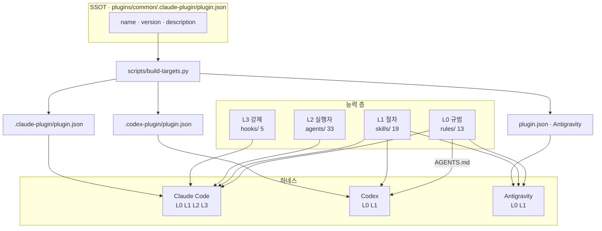
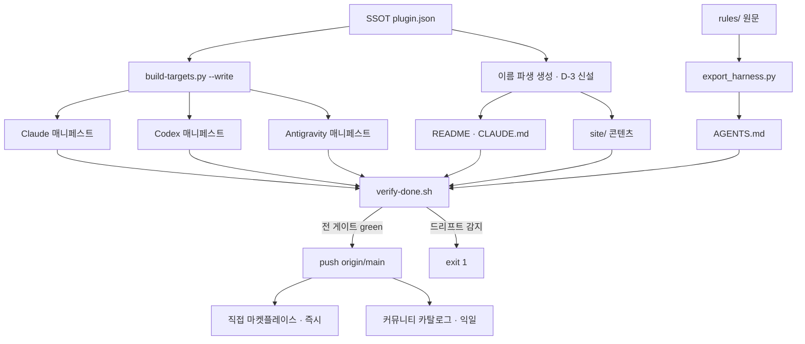
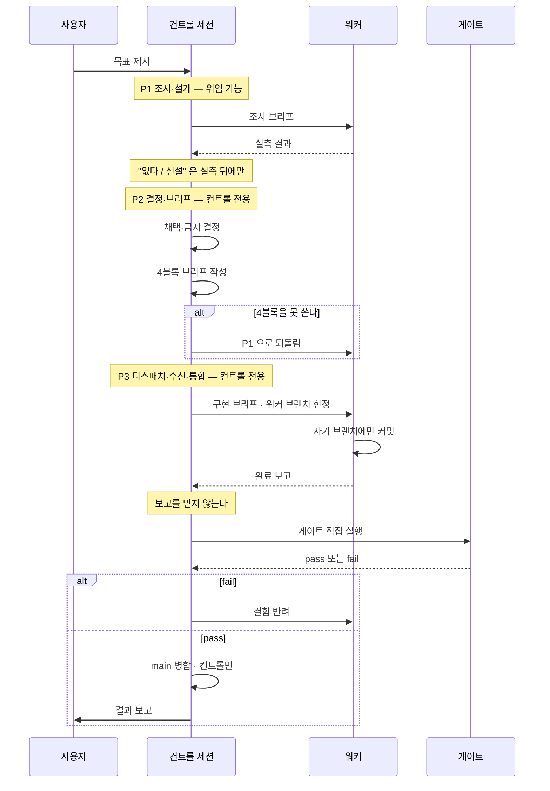
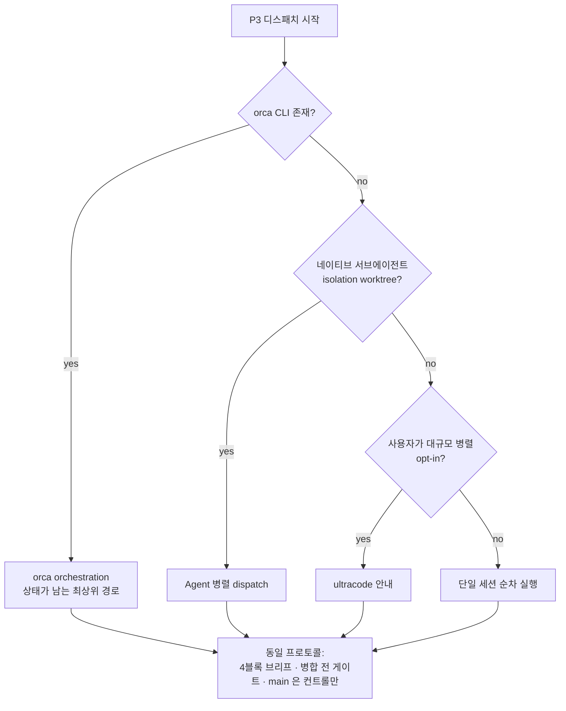
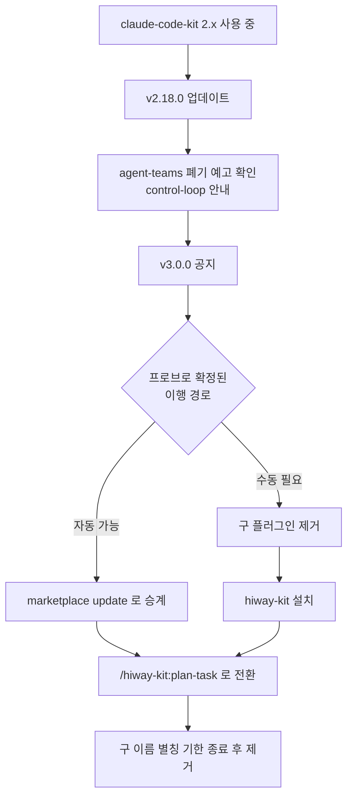
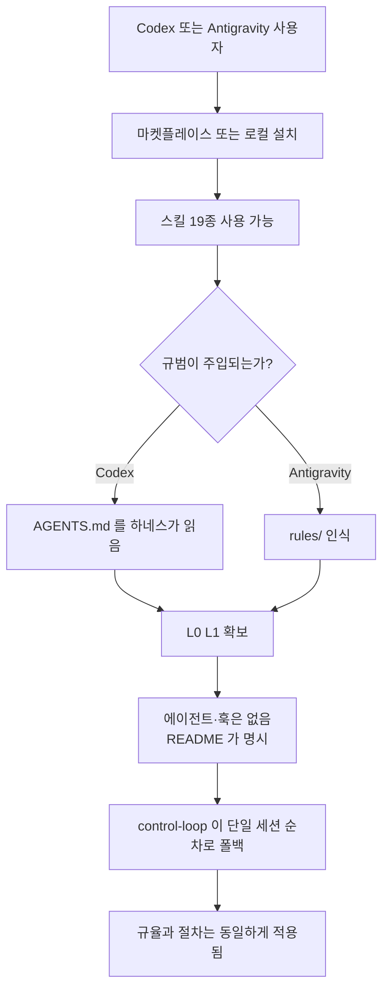
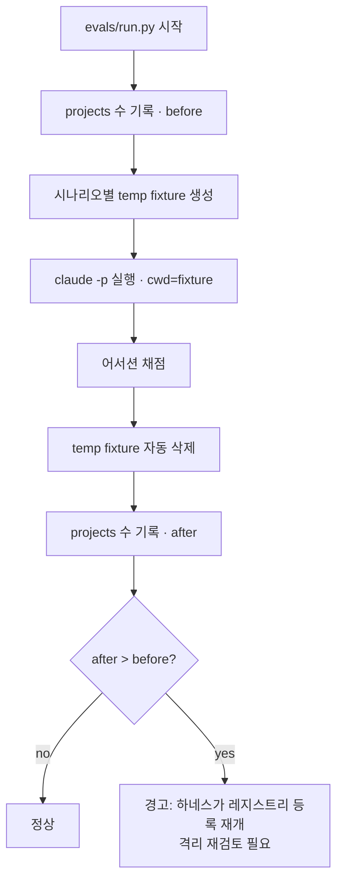
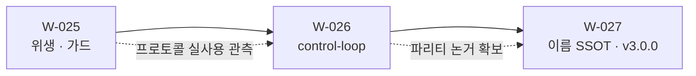

# 하이웨이 프로그램 설계 — 하네스 중립 전환 (W-025 ~ W-027)

> 상태: **설계 최종본**. 구현 전. 이 문서가 세 배치의 SSOT다.
> 작성: 2026-09-07 / 컨트롤 세션 `This-HW/planning-control-session` @ 086b2ae
> 선행 브리프: 세션 내 아티팩트 "하이웨이 전환 브리프" (본 문서가 그것을 대체·정정한다)

---

## 0. 목표와 판단 기준

**목표.** 킷을 "Claude Code 전용 플러그인"에서 "하네스 중립 에이전트 규율 킷"으로 옮기되,
**이름이 약속하는 것과 실제로 이식되는 것이 어긋나지 않게** 한다.

**판단 기준(모든 결정에 동일 적용).**

1. **약속과 실물의 일치** — 문서·이름·매니페스트가 주장하는 것은 실측으로 뒷받침돼야 한다.
   이 레포가 반복해서 잡아온 결함은 전부 "켜져 있다는 착각" 계열이다.
2. **부채 없음** — 같은 질문에 답하는 컴포넌트를 둘 두지 않는다. 생성물은 SSOT에서 파생한다.
3. **소비자 우선** — 설치하는 사람의 환경에서 동작해야 한다. 특정 플러그인·MCP·CLI의 존재를 가정하지 않는다.

---

## 1. 관측 — 실측 근거

### 1.1 하네스별 실제 이식 범위

| 컴포넌트 | 개수 | Claude Code | Codex | Antigravity |
| --- | ---: | --- | --- | --- |
| skills | 19 | 전부 | 전부 | 전부 |
| rules | 13 | 세션 주입 | `AGENTS.md` 경유 | 인식 |
| agents | 33 | 전부 | 전용 필드 없음 | **0종 인식** |
| hooks | 5 | 전부 | 의미 없음 | 싣지 않음 |

근거는 새로 만든 것이 아니라 `packaging/targets.json` 에 이미 실측 기록으로 있다 —
`agy` 는 `agents/` 를 재귀하지 않아 카테고리 디렉토리 4개를 "에이전트 4개"로 오등록하고
실제 33개는 하나도 읽지 못한다. Codex 훅은 형식 변환은 되지만 킷의 훅 5개가 전부 Claude Code
이벤트 모델(`hookSpecificOutput.additionalContext`, `tool_name` 매처, `decision:block`)에
묶여 있어 실행돼도 제어 효과가 없다.

### 1.2 지금 어디에도 설치돼 있지 않다

```
$ find ~/.codex/plugins -maxdepth 3 -type d   → openai-curated-remote 뿐. kit 없음
$ ls ~/.antigravity/extensions/               → VS Code 확장뿐. kit 없음
```

다중 하네스 지원은 **생성 + 1회 실측 검증**까지고 상시 사용이 아니다. 즉 현재의 "3사 공통"은
**매니페스트 수준의 주장**이다.

### 1.3 이름이 SSOT에서 파생되지 않는다

`git grep -l "claude-code-kit"` → **59개 파일**. `build-targets.py` 가 매니페스트 3종을
SSOT에서 생성하는 규율을 세워뒀는데, 문서·사이트·스킬 본문의 이름은 그 규율 밖이다.
**개명 비용이 파일 수에 비례한다는 것 자체가 부채다.**

### 1.4 정정 — eval 레지스트리 오염은 현행 결함이 **아니다**

선행 브리프는 `~/.claude.json` 의 유령 프로젝트 26건을 "eval 러너가 지금도 오염시킨다"고
적었다. **대조 실험으로 반증됐다.**

| 실험 | 명령 | projects 델타 |
| --- | --- | ---: |
| 대조군 | 임시 디렉토리에서 `claude -p` | **0** |
| 실제 eval 형태 | `-p` + `--append-system-prompt` + `--permission-mode bypassPermissions` + `--allowedTools` | **0** |
| 격리 실험 | `CLAUDE_CONFIG_DIR=<tmp>` | 0 (격리 자체는 동작 — 전용 `.claude.json`·`projects/`·`sessions/` 생성) |

`evals/run.py:1134` 의 `tempfile.TemporaryDirectory(prefix="ckkit-eval-…")` 와
`subprocess.run(cmd, cwd=str(work_dir))` 는 사실이지만, **현행 Claude Code 2.1.263 은
`-p` 세션의 cwd 를 전역 레지스트리에 등록하지 않는다.** 유령 26건은 과거 버전의 잔재다.

> 부수 관측: `CLAUDE_CONFIG_DIR` 로 config dir 를 격리하면 **인증이 따라가지 않는다**
> ("Not logged in"). 키체인 항목(`svce="Claude Code-credentials"`)은 config dir 로
> 스코프되지 않는데도 그렇고, `oauthAccount`·`userID`·`hasCompletedOnboarding` 를
> 시드해도 해소되지 않았다. **따라서 격리는 채택하지 않는다** — 동작하지 않는 격리를
> 넣는 것이 오염보다 나쁘다.

**설계에 미치는 영향**: W-025 에서 "러너 수정"은 빠진다. 남는 것은 ① 일회성 청소와
② 회귀 가드다.

### 1.5 로컬 위생

- **처리 완료** — `~/.claude/mcp-disabled-stash.json` 삭제. 평문 API 키 2건(gemini·magic)이
  3개월간 방치돼 있었다. 사용자가 미사용 확인. **발급처 폐기는 사용자 몫으로 남아 있다.**
- 잔재: 고아 임시 클론 4개 + `cck-probe-marketplace`(W-019 프로브) + 킷 구버전 캐시 2개 ≈ 5.2MB
- 유령 플러그인 설치 기록 8건 (삭제된 워크트리 7 + `all-note` 1)
- 설정 백업 4개 (`settings.json.bak`, `config.toml.bak`, `.backup-20260828-llama-local`, `.bak-D368`)
- `settings.json` 33KB 중 79% 가 orca 훅 shim 12벌 반복 — **orca 소유, 손대지 않는다**
- `permissions.allow` 42개가 `skipDangerousModePermissionPrompt: true` + bypass 상시 운영과 공존
- 정상 확인: 전역 `CLAUDE.md` 226B(graphify 하나), `~/.claude/agents/`·`commands/` 비어 있음 — 이중 로드 없음

---

## 2. 결정

### D-1 — 이름은 하나다. dual-name 을 채택하지 않는다

사용자 제안: *"Claude 쪽은 `claude-code-kit` 로 두고 업데이트분만 `hiway-kit` 으로 추가"*.
**반려한다.** 근거:

- **기능 충돌** — Claude Code 사용자가 둘 다 설치하면 같은 19개 스킬·33개 에이전트가
  두 네임스페이스로 **중복 등록**된다. 이름 충돌이지 미관 문제가 아니다.
- **불변식 파괴** — `packaging/targets.json` 의 `source._meta.authority` 는
  *"name·version·… 의 SSOT는 이 매니페스트다. 어떤 타겟 생성물도 이 값을 재정의하지 않는다"* 다.
  타겟별로 다른 이름을 쓰면 이 불변식이 깨지고, **네 번째 드리프트 게이트**가 필요해진다 —
  이 레포는 그 통합을 명시적으로 거부해 뒀다.
- **부채 형태** — 일회성 이행 비용을 피하려고 **영구 분기**를 만드는 거래다. 릴리스·문서·이슈가
  전부 두 갈래가 된다.

사용자의 실제 관심사(**기존 설치를 깨지 않는 것**)는 분기가 아니라 **기한 있는 폐기 별칭**으로
푼다 → D-4.

### D-2 — 파리티 계약: 4층 + 폴백 사다리

세 하네스에 무엇을 약속할지 확정한다. 최소공통분모로 깎으면(스킬만 남기면) Claude Code 에서의
가치가 붕괴하고, 전부 이식하려 하면 플랫폼이 막는다. **층으로 나누고, 각 층이 위층으로
degrade 되게 한다.**

| 층 | 내용 | 도달 범위 | 없을 때의 폴백 |
| --- | --- | --- | --- |
| **L0 규범** | `rules/` 13 | 전 하네스 (CC=주입, 그 외=`AGENTS.md`) | — (최종 폴백) |
| **L1 절차** | `skills/` 19 | 전 하네스 | L0 규범이 문장으로 남는다 |
| **L2 실행자** | `agents/` 33 | Claude Code | L1 스킬이 단일 세션 순차로 수행 |
| **L3 강제** | `hooks/` 5 | Claude Code | L0 규범이 약한 강제로 남는다 |

**약속 문장(README·매니페스트가 같은 말을 해야 한다):**

> 규범과 절차(L0·L1)는 모든 하네스 공통. 전용 실행자와 자동 강제(L2·L3)는 Claude Code 심화 기능.

이 계약이 정직한 이유: 폴백 사다리가 있어 **L2·L3 가 없어도 킷이 무의미해지지 않는다.**
Codex 사용자는 규율과 절차를 얻고, 자동화만 잃는다.

### D-3 — 이름을 SSOT에서 파생시킨다 (개명의 선행 과제)

`build-targets.py` 가 매니페스트에 하는 일을 문서·사이트에도 적용한다. 개명 비용을
**파일 수 비례 → 상수**로 바꾼다. 이것이 없으면 v3.0.0 개명은 59파일 수작업이고,
다음 개명도 같은 값을 다시 낸다.

- 적용 대상: `README.md`, `plugins/common/README.md`, `site/` 콘텐츠, `CLAUDE.md`, 스킬 본문
- 방식: SSOT(`plugin.json` 의 `name`)에서 파생하는 생성 단계 + `verify-done.sh` 드리프트 검사
- **주의**: 이것이 § 드리프트 게이트 **네 번째**가 된다. 레포 규약상 *"네 번째가 필요해지는
  시점에 재검토"* 하기로 돼 있으므로, W-027 에서 기존 셋(§11·§13·§14)과 **묶을지 판단**한다.
  묶지 않기로 결론 나면 그 근거를 CLAUDE.md 에 기록한다.

### D-4 — 개명은 v3.0.0 한 번. 이행 경로는 실측 후 확정

- 새 이름: **`hiway-kit`**. 네임스페이스 프리픽스가 사용자 타이핑 표면이므로 18자 → 9자가
  실질 이득이다(`/claude-code-kit:plan-task` → `/hiway-kit:plan-task`). `hw` 는 하드웨어와
  충돌해 탈락, `hiway-code-kit` 은 이득이 절반.
- **이행 메커니즘은 지금 확정하지 않는다.** 마켓플레이스 항목 이름과 `plugin.json` 의 `name`
  이 불일치할 때 설치가 성립하는지 확인되지 않았다. 이 레포의 기준(`runtime-verified`)에
  미달하므로, **스크래치 마켓플레이스 프로브로 실측한 뒤** 확정한다 — W-019 의
  `cck-probe-marketplace` 와 동일 기법(그 잔재가 지금 캐시에 남아 있다).
- 프로브가 답해야 할 질문: ① 구 이름 항목을 폐기 표시로 남긴 채 신 이름으로 설치가 되는가
  ② 구 이름 설치본과 신 이름 설치본이 공존할 때 스킬·에이전트가 중복 등록되는가
  ③ `enabledPlugins` 키 이행이 자동인가 수동인가
- 커뮤니티 카탈로그는 **이름 변경 = 새 리스팅**이다(버전 갱신과 달리 재제출 필요).

### D-5 — 컨트롤 스킬은 하나, 3페이즈

축은 *기획 대 컨트롤*이 아니라 **결정 대 조사**다. 판별식은 이미 있다 —
*"브리프에 IN/OUT·수용 기준·금지 목록을 4블록으로 쓸 수 있으면 워커"*.
이 테스트를 설계 작업에 대면 설계는 통째로 한쪽에 가지 않고 **쪼개진다**: 설계에 필요한
*조사*는 4블록으로 쓸 수 있어 위임 가능하고, *결정*은 4블록을 **쓰는 행위 자체**라 위임 불가.

따라서 스킬을 기획용·컨트롤용으로 나누지 **않는다**. 나누면 결정과 브리프 작성 사이에
이음매가 생기는데, 그 이음매가 관측된 실패 지점이다 — 올림포스 운영에서 **컨트롤이 전제를
추측해 쓴 브리프가 하루 4건 워커에게 반려**됐다.

**스킬명: `control-loop`.** 레포에 이미 있는 `rules/loop-engineering.md` 어휘와 맞는다.

### D-6 — 운송(transport)은 규범이 아니라 부록이다

`orca` 는 배포물(`plugins/`) 안에 0건이다. 우연이 아니라 소비자 우선 원칙의 결과다.
`control-loop` 의 **규범 본문은 운송을 모른다** — 프로토콜(역할 경계·4블록 계약·검증·통합)만
소유한다. 운송별 실행 레시피는 **비규범 부록**으로 분리하고, 각 항목은 감지 명령 + 최소 레시피만
담는다. 부록이 낡아도 스킬은 계속 동작한다. (`rules/` ↔ `docs/architecture/rules/` 의 정본-해설
분리와 같은 층 나눔.)

### D-7 — `agent-teams` 는 흡수 후 폐기 (기한 있는 2단계)

`agent-teams` 는 현재 "대규모는 `ultracode` 로 가라"는 라우팅 안내뿐이고, 그것은
`control-loop` 부록의 한 운송 항목이다. 같은 질문에 답하는 스킬 둘을 남기지 않는다.

1. **v2.18.0** — `control-loop` 신설. `agent-teams` 본문을 폐기 예고로 교체(내용은 흡수됨,
   `control-loop` 를 가리킴). 스킬 수 19 유지.
2. **v3.0.0** — `agent-teams` 제거. 스킬 수 19 → 18. `check_doc_counts.py` 대상 문서 전부 갱신.

메이저에서 제거하는 이유: 스킬 삭제는 `/agent-teams` 를 치던 사용자에게 파괴적 변경이다.

### D-8 — `control-loop` 의 eval 은 C등급으로 **명시 등재**한다

`evals/` 의 시나리오 29종은 전부 *에이전트 한 종의 단일 출력*을 채점한다. `control-loop` 는
여러 턴에 걸친 세션 행동이라 이 러너로 채점할 수 없다.

**침묵하지 않는다.** `evals/policy.json` 의 `tiers._tier2Classification` 에 등급 `C` + 사유 +
승격 조건과 함께 등재한다. W-024 가 신설한 `check_classification_complete` 가 이 누락을
경고로 잡으므로, 등재하지 않으면 게이트가 운다 — **그 경고가 정확히 이 결정을 강제하는 장치다.**

> 이것이 `consensus-builder` 사고(분류엔 있는데 시나리오가 없어 조용히 통과)의 재발 방지다.
> 다른 점: 그때는 A등급이라 시나리오가 **있어야 했고**, 지금은 C등급이라 **없는 것이 정답**이며
> 그 사실이 기록된다.

### D-9 — 4블록 브리프는 기계 게이트를 두지 않는다 (의도적)

W-021/022 가 폐기한 `---DELEGATION_SIGNAL---` 과 겉모습이 비슷하므로 차이를 명시한다.

| | 폐기된 신호 블록 | 4블록 브리프 |
| --- | --- | --- |
| 소비자 | **없음** — 파싱하는 코드가 어디에도 없었다 | **워커 에이전트** — 실제로 읽고 그대로 수행한다 |
| 누락 시 | 아무 일도 안 일어남 (조용한 무효화) | 워커가 완료 조건을 몰라 **에스컬레이션한다** |
| 강제 방식 | 자연어 지시 → 모델 판단 | 소비 지점에서 자연 발생 |

**소비자가 있는 계약은 게이트 없이도 산다.** 없던 것이 폐기된 이유였다.

### D-10 — eval 잔재는 청소하되, 회귀 가드를 남긴다

§1.4 로 러너 수정은 불필요해졌다. 그러나 26건이 **몇 달간 아무도 모르게** 쌓였다는 사실은
남는다 — *"검사 대상이 아닌 것은 결코 red 가 되지 않는다"*.

- 일회성: 유령 프로젝트 항목 28건 정리
- 가드: 러너가 **전체 실행 전후의 `~/.claude.json` projects 수를 비교**해 증가 시 경고.
  추가 API 비용 0, 코드 ~10줄. 하네스가 다시 등록하기 시작하면 그날 알게 된다.

### D-11 — permissions 는 "인정하고 최소화"로 간다

현재는 `skipDangerousModePermissionPrompt: true` + bypass 상시 운영이라 42개 allowlist 가
**실제로 게이트하는 것이 거의 없다.** 방어선이 있다고 *믿게 만드는* 상태가 가장 나쁘고,
이는 킷이 반복해서 잡아온 "켜져 있다는 착각"과 같은 클래스다.

**채택**: bypass 운영을 인정하고 allowlist 를 **정직한 최소**로 줄인다.
프로젝트 전용(`Bash(hantu:*)`)과 광범위 쓰기(`curl`·`ssh`·`scp`·`source`·`chmod`)를 뺀다.
bypass 를 끄는 날 allowlist 가 **검토된 진짜 방어선**이 되게 하는 것이 목적이다.
되돌리기는 한 커밋이다.

---

## 3. 시스템 아키텍처

### 3.1 능력 층과 하네스 도달 범위



### 3.2 폴백 사다리 — 없는 층은 위층이 받는다


이 사다리가 D-2 파리티 계약을 정직하게 만든다 — 하위 층이 없어도 킷이 무의미해지지 않는다.

---

## 4. 플로우

### 4.1 시스템 플로우 — 빌드에서 배포까지



### 4.2 시스템 플로우 — `control-loop` 3페이즈



### 4.3 시스템 플로우 — 운송 감지 사다리



규범은 `P` 하나다. 위 분기는 **비규범 부록**이며, 전부 실패해도 `SQ` 로 끝나 fail-open 한다.

### 4.4 유저 플로우 — 기존 사용자의 v3.0.0 이행



`E` 분기가 **미확정**이라는 것이 D-4 의 핵심이다. 프로브 전에는 어느 쪽도 문서에 쓰지 않는다.

### 4.5 유저 플로우 — 신규 사용자가 Codex/Antigravity 에서 설치



`H` 를 **숨기지 않는 것**이 D-2 계약의 요체다.

### 4.6 시스템 플로우 — eval 실행과 회귀 가드



---

## 5. 작업 분할



### W-025 — 로컬·러너 위생 (버전 무변경, 레포 로컬 + 환경)

| 항목 | 내용 | 담당 |
| --- | --- | --- |
| 25-1 | 유령 프로젝트 항목 28건 정리 | 컨트롤 |
| 25-2 | eval 회귀 가드 (`run.py` projects 델타 경고) | 워커 |
| 25-3 | 플러그인 캐시 잔재 정리 (temp 클론 4 · cck-probe · 구버전 캐시) | 컨트롤 |
| 25-4 | 유령 플러그인 설치 기록 8건 정리 | 컨트롤 |
| 25-5 | 설정 백업 4개 정리 | 컨트롤 |
| 25-6 | `permissions.allow` 최소화 (D-11) | 컨트롤 |

25-2 만 워커인 이유: 코드 변경 + 되돌려-FAIL 테스트가 붙는 유일한 항목이다.
나머지는 환경 정리라 4블록 브리프를 쓸 대상이 없다.

### W-026 — `control-loop` 스킬 (v2.18.0)

| 항목 | 내용 | 담당 |
| --- | --- | --- |
| 26-1 | `skills/control-loop/SKILL.md` — 3페이즈 규범 본문 | 워커 |
| 26-2 | 운송 부록 (비규범, 감지 사다리) | 워커 |
| 26-3 | `agent-teams` 폐기 예고로 교체 (D-7 1단계) | 워커 |
| 26-4 | `policy.json` 에 C등급 등재 (D-8) | 컨트롤 |
| 26-5 | 버전 범프 + CHANGELOG + 문서 카운트 | 컨트롤 |

**W-025 를 지금 방식으로 먼저 돌리는 것이 26-1 의 입력이다.** 프로토콜을 한 번 더 실사용
관측하고 그 관측을 재료로 쓴다 — 스킬을 먼저 쓰고 나중에 맞추지 않는다.

### W-027 — 이름 SSOT화 + v3.0.0

| 항목 | 내용 | 담당 |
| --- | --- | --- |
| 27-1 | 마켓플레이스 이행 프로브 (D-4 질문 3종 실측) | 워커 |
| 27-2 | 이름 SSOT 파생 생성기 + 드리프트 검사 (D-3) | 워커 |
| 27-3 | 네 번째 드리프트 게이트 통합 여부 판정 + 근거 기록 | 컨트롤 |
| 27-4 | 파리티 계약 문장을 README·매니페스트에 반영 (D-2) | 워커 |
| 27-5 | `hiway-kit` 개명 + `agent-teams` 제거 + 태그 | 컨트롤 |
| 27-6 | 커뮤니티 카탈로그 재제출 | 컨트롤 |

---

## 6. 범위 밖 (명시적으로 하지 않는 것)

- **Codex·Antigravity 용 훅 재구현** — `targets.json` 의 `_hooksEnableWhen` 조건이 그대로 유효하다.
  형식 변환 가능성은 재검토 근거가 아니다.
- **`agents/` 디렉토리 구조 변경** — Antigravity 가 중첩을 재귀하지 않는다는 이유로 33개
  에이전트 레이아웃을 바꾸지 않는다. 플랫폼 한계를 킷 구조로 흡수하지 않는다.
- **Cursor·Pi·OpenCode 타겟 활성화** — 각각의 `_disabledReason` 이 유효하다.
- **`~/.claude/projects` 1.4GB 정리** — 트랜스크립트는 메모리·`self-improve` 의 원천 자산이다.
  보존 기준을 정하기 전에는 지우지 않는다.
- **orca 오케스트레이션을 배포물에 넣는 것** — D-6.
- **`settings.json` 의 orca 훅 shim** — 남의 생성물이다.

---

## 7. 수용 테스트

**W-025**

1. `~/.claude.json` projects 에 경로가 없는 항목 0건
2. eval 1회 실행 후 projects 델타 0 이고, 인위적으로 증가시킨 상황에서 경고가 실제로 출력됨(되돌려-FAIL)
3. `scripts/verify-done.sh` green
4. bypass 를 끈 상태에서 축소된 allowlist 로 일상 작업이 성립함

**W-026**

5. `control-loop` 규범 본문에 `orca` 문자열 0건 (`git grep -c orca plugins/common/skills/control-loop/SKILL.md`)
6. `check_classification_complete` 가 경고 없이 통과 (C등급 등재 확인)
7. `agent-teams` 를 호출하면 `control-loop` 로 안내됨
8. 문서 카운트 게이트 green (스킬 19 유지)

**W-027**

9. 프로브가 D-4 의 질문 3종에 `runtime-verified` 답을 남김
10. `plugin.json` 의 `name` 만 바꾸고 생성기를 돌리면 문서·사이트 이름이 전부 따라옴
11. 세 매니페스트의 `name` 이 SSOT 와 일치 (`build-targets.py --check`)
12. README 의 파리티 문장과 매니페스트 `description` 이 같은 약속을 말함
